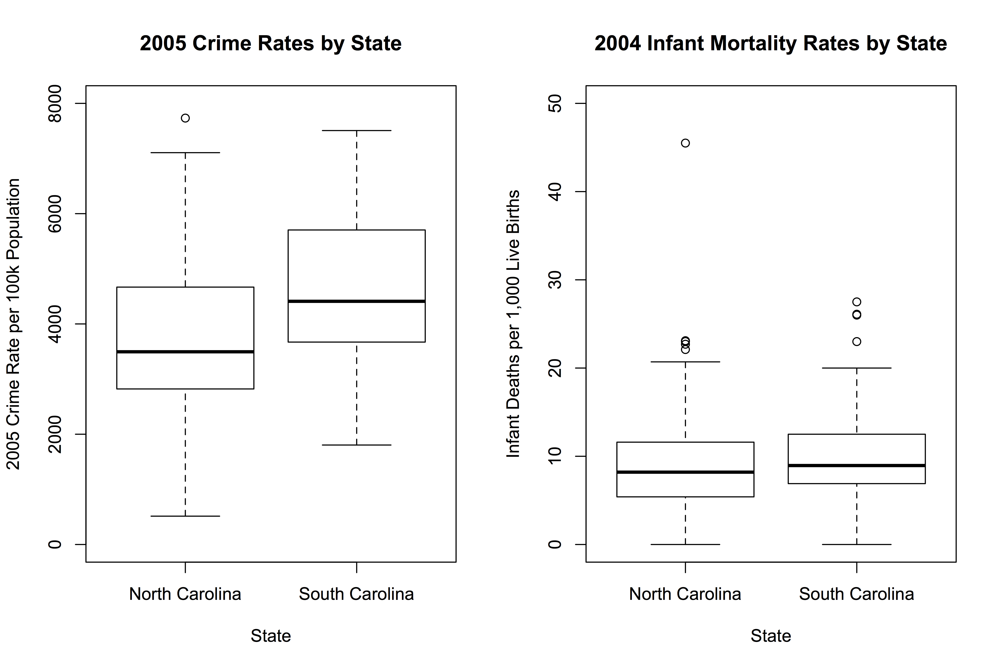
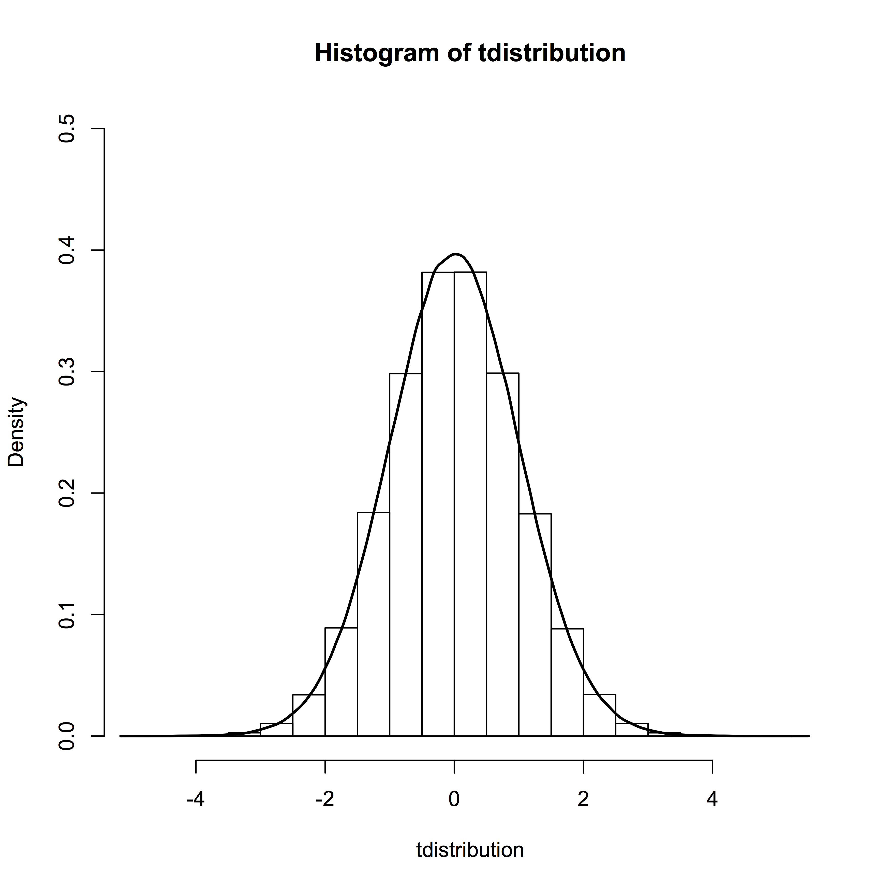

## CRJU 816 - Applied Quantitative Data Analysis

* Semester: Spring 2020
* ~Class Meets: Tuesday 5:50-8:35, Gambrell 150~
* Class Meets: Tuesday 5:00-7:30, Gambrell Basement Lab
* Instructor: Bobby Brame (rwb@sc.edu; 803-777-6537)
* Office Hours: MWF 11:30-12:00 (or by appointment)
* Office Location: Currell 208

### Class Description

Review of applied quantitative methodological literature in criminology and criminal justice. Topics include analysis of data from randomized field experiments, interrupted time-series studies, regression discontinuity studies, instrumental variable estimation, treatment probability matching estimators, statistical power analysis, and study planning. 

### Reading Materials

There is no assigned textbook for this class, however, a number of readings will be assigned. These readings will be based on journal articles or will be excerpted from various books that have been placed on reserve in the University Library. Books we will be consulting include:

* Freedman, David A. (2009). *Statistical Models: Theory and Practice*. New York: Cambridge University Press.
* King, Gary (1989). *Unifying Political Methodology: The Likelihood Theory of Statistical Inference*. New York: Cambridge University Press.
* Manski, Charles F. (1995). *Identification Problems in the Social Sciences*. Cambridge, MA: Harvard University Press.
* Wasserman, Larry (2004). *All of Statistics: A Concise Course in Statistical Inference*. New York: Springer.

*Note*: this is the library [website](http://libcat.csd.sc.edu/search*eng/r?CRJU816+%28Columbia%29+--+Applied+Quantitative+Data+Analysis++%5BSpring+2020%5D) showing these course materials.

### Statistical Software

I will be using R in this class. R is the free version of the [S programming language](https://web.archive.org/web/20181014111802/http://ect.bell-labs.com/sl/S/). If you choose not to use R, that's fine but I may not be able to help you if you run into problems (although I'm happy to try!). R is freely available and runs on all commonly used computers. I will provide an overview of R during the first class session.

### Learning Outcomes

At the end of this course, you should be able to: (1) write computer code to estimate statistical models that are commonly used in criminological research applications; (2) develop and interpret appropriate statistical graphics for a wide range of data analysis problems arising in criminology; and (3) call on an array of inferential procedures that are regularly used by criminologists to answer scientifically interesting questions.

### Grades

Your grade will be based on your performance on weekly written data analysis assignments administered throughout the semester. For each assignment, you will submit a written answer to the question or problem that is posed and the supporting computer code that was used to obtain that answer. Each assignment will be graded on organization, readability, accuracy, and completeness for a total of 100 possible points. At the end of the semester, I will average your assignment grades and assign letter grades using the following scale: 90-100=A, 85-89=B+, 80-84=B, 75-79=C+, 70-74=C, 65-69=D+, 60-64=D, 59 and below=F. Assignments are to be treated like take-home examinations -- which means the work you submit must be your own.

### Attendance

It is problematic for you to miss any classes because the material we are covering is mostly cumulative and it will be hard for you to successfully complete the assignment if you aren't in class when we discuss the foundational issues for the assignment. While I recognize that absences are sometimes necessary, I am asking you to keep them to a minimum and to meet with me whenever you need to miss a class. 

### Disability Accommodations

If you have or think you might have a disability, injury, or other condition that could affect your class performance, please contact the [Student Disability Resource Center](https://sc.edu/about/offices_and_divisions/student_disability_resource_center/). I will abide by accommodations recommended by the Disability Resource Center in this course.

### Academic Integrity Statement

You are expected to practice the highest standards of academic integrity. Any deviation from this expectation will result in a minimum academic penalty of your failing the assignment, and may result in additional disciplinary measures. This includes improper citation of sources, presenting someone else's work as your own, and any other form of academic misrepresentation. Please take a few moments to familarize yourself with the University's expectations for student academic integrity which can be found [here](http://www.sc.edu/policies/ppm/staf625.pdf).

### Writing Center

The University's [Writing Center](https://sc.edu/study/colleges_schools/artsandsciences/english_language_and_literature/beyond_classroom/writing_center/index.php) is available to support your efforts to improve your writing. I enourage you to take advantage of this resource during your time in this course.

### Course Outline

* 1/14: Introduction to R
* 1/21: Data visualization
* 1/28: Statistical models
* 2/4: Inference
* 2/11: Bias, efficiency, and consistency
* 2/18: Statistical power and significance testing
* 2/25: Identification
* 3/3: Maximum likelihood
* 3/10: Spring break; no class
* 3/17: Contingency tables
* 3/24: Randomized experiments
* 3/31: Quasi-experimental methods
* 4/7: Regression
* 4/14: Point processes
* 4/21: Instrumental variables
* 4/28: Reading day; no class
* 5/5: Censoring

# Lesson 1 (Tuesday January 14, 2020)

* An overview of the R Project for Statistical Computing is [here](https://www.r-project.org).
* A brief history of the S language and the R project can be found [here](https://www.r-project.org/conferences/useR-2006/Slides/Chambers.pdf), [here](https://blog.revolutionanalytics.com/2014/01/john-chambers-recounts-the-history-of-s-and-r.html), and [here](https://www.stat.auckland.ac.nz/~ihaka/downloads/Interface98.pdf).
* Here is a helpful [primer](http://www.stat.cmu.edu/~larry/all-of-statistics/=R/Rintro.pdf) on the basics of using R.

#### 1. How to Read in a Data Set

Consider the following comma-delimited dataset:

```R
state,county,icr2005,icr2006,unemployment,urban,region,infantmort
NC,Alamance,4668.4,4807.4,2.8,2,2,8.5
NC,Alexander,2538.4,2498.7,2.3,2,2,12.7
NC,Alleghany,.,.,7.0,1,1,20.4
NC,Anson,5511.1,4921.7,6.6,1,2,10.5
NC,Ashe,1744.7,1882.4,6.2,1,1,3.8
NC,Avery,1235.0,1270.8,3.4,1,1,0.0
NC,Beaufort,3329.7,3351.4,7.6,2,3,1.7
NC,Bertie,2954.2,2592.6,9.1,1,3,8.7
NC,Bladen,4104.7,5089.9,5.8,1,3,12.8
NC,Brunswick,4661.4,4653.5,4.5,2,3,6.7
NC,Buncombe,4149.6,3715.5,2.6,2,1,5.4
NC,Burke,2987.5,2513.5,3.2,2,1,5.0
NC,Cabarrus,3420.8,3603.8,2.6,2,2,8.8
NC,Caldwell,3404.9,3467.6,2.4,2,1,11.5
NC,Camden,730.2,870.0,2.6,2,3,0.0
NC,Carteret,3179.2,3338.1,4.4,2,3,9.2
NC,Caswell,2420.8,2554.8,2.6,1,2,4.7
NC,Catawba,5243.3,4642.4,2.2,2,2,5.1
NC,Chatham,2412.8,2666.0,1.9,1,2,11.1
NC,Cherokee,2846.0,.,7.4,1,1,7.7
NC,Chowan,2708.9,2826.5,4.0,1,3,5.5
NC,Clay,1486.8,1610.0,4.1,1,1,11.8
NC,Cleveland,4360.1,3945.9,6.0,2,2,11.8
NC,Columbus,5987.8,5688.5,10.6,1,3,12.1
NC,Craven,4318.5,4175.7,4.2,2,3,8.2
NC,Cumberland,6846.9,7380.2,4.2,2,2,10.7
NC,Currituck,2875.3,2458.2,2.5,1,3,0.0
NC,Dare,5404.7,5010.1,5.1,1,3,6.1
NC,Davidson,3508.4,3545.6,2.8,2,2,7.4
NC,Davie,3508.4,3545.6,4.3,2,2,7.2
NC,Duplin,3399.5,3027.9,5.0,1,3,6.3
NC,Durham,6606.6,6640.5,2.3,3,2,6.8
NC,Edgecombe,5369.4,5856.9,7.5,2,3,14.0
NC,Forsyth,5764.6,6072.4,2.8,3,2,10.0
NC,Franklin,2313.9,2152.1,2.6,2,2,7.0
NC,Gaston,5487.7,5301.2,6.1,3,2,7.7
NC,Gates,1356.3,.,3.2,1,3,8.8
NC,Graham,.,.,8.1,1,1,11.0
NC,Granville,3877.8,3965.8,4.1,2,2,8.1
NC,Greene,2415.2,2949.5,4.4,1,3,22.7
NC,Guilford,5819.0,5754.7,2.9,3,2,10.2
NC,Halifax,5346.4,5270.5,7.5,1,3,22.1
NC,Harnett,4189.6,3928.9,3.9,2,2,8.9
NC,Haywood,3120.5,3283.0,3.9,2,1,5.7
NC,Henderson,3010.9,2921.6,2.1,2,1,5.4
NC,Hertford,4917.8,3536.7,5.5,1,3,9.6
NC,Hoke,4095.7,3997.9,8.0,2,2,9.9
NC,Hyde,514.0,.,6.5,1,3,0.0
NC,Iredell,4015.9,.,3.3,2,2,4.6
NC,Jackson,3562.9,3681.7,3.5,1,1,2.9
NC,Johnston,3327.7,3583.8,2.2,2,2,7.8
NC,Jones,3437.2,2810.9,5.2,1,3,0.0
NC,Lee,4823.9,4739.9,4.1,2,2,13.4
NC,Lenoir,6610.5,5830.8,5.5,2,3,11.6
NC,Lincoln,1104.7,3792.7,4.1,2,2,3.5
NC,Macon,2165.6,2270.4,3.5,1,1,9.1
NC,Madison,1257.5,1313.6,3.3,1,1,0.0
NC,Martin,5161.5,3466.2,9.5,1,3,3.2
NC,McDowell,2841.8,2779.4,4.6,1,1,8.2
NC,Mecklenburg,7732.8,7663.6,2.5,3,2,9.2
NC,Mitchell,.,.,5.1,1,1,6.1
NC,Montgomery,3347.7,4144.9,4.0,1,2,5.4
NC,Moore,3000.4,3045.0,3.9,2,2,6.2
NC,Nash,5507.4,6071.8,5.3,2,2,11.4
NC,New Hanover,6445.1,6157.7,3.5,3,3,5.0
NC,Northampton,3633.1,2818.7,6.5,1,3,13.2
NC,Onslow,2828.0,4067.0,3.6,2,3,6.8
NC,Orange,3913.3,4103.3,1.3,2,2,12.0
NC,Pamlico,673.1,.,3.7,1,3,16.3
NC,Pasquotank,4662.6,4336.7,3.7,1,3,5.8
NC,Pender,2492.4,2740.0,4.7,1,3,6.3
NC,Perquimans,2660.5,2567.1,3.7,1,3,17.9
NC,Person,3212.1,3531.3,4.7,1,2,8.9
NC,Pitt,5426.9,5805.7,4.7,2,3,7.1
NC,Polk,2124.3,2020.0,3.4,1,1,12.3
NC,Randolph,3827.7,3786.6,3.1,2,2,3.4
NC,Richmond,5564.9,6534.4,6.6,1,2,23.0
NC,Robeson,7106.0,6572.1,9.0,2,2,12.8
NC,Rockingham,4437.6,4717.3,5.4,2,2,3.8
NC,Rowan,3818.4,.,4.8,2,2,14.3
NC,Rutherford,3568.5,3178.4,7.6,2,1,7.7
NC,Sampson,3823.3,3481.7,4.0,1,3,10.4
NC,Scotland,4990.8,4203.1,7.4,2,2,20.7
NC,Stanly,2735.0,2997.0,4.2,2,2,16.9
NC,Stokes,2923.5,2890.6,3.2,2,2,8.2
NC,Surry,3686.1,3663.2,4.3,2,2,5.8
NC,Swain,4172.5,5337.1,12.5,1,1,5.1
NC,Transylvania,1985.6,1977.9,2.6,1,1,7.9
NC,Tyrrell,1868.7,1617.9,9.7,1,3,45.5
NC,Union,3494.9,3692.5,2.3,2,2,9.6
NC,Vance,6977.1,6996.1,8.9,2,2,19.8
NC,Wake,3359.2,3326.5,1.5,3,2,7.0
NC,Warren,3167.8,3293.7,7.8,1,3,5.3
NC,Washington,3093.5,.,6.3,1,3,0.0
NC,Watauga,2820.9,2874.5,1.5,2,1,23.1
NC,Wayne,4787.8,4712.3,4.0,2,3,10.8
NC,Wilkes,2863.8,2716.3,3.3,1,1,12.0
NC,Wilson,4269.1,4796.6,7.0,2,3,16.7
NC,Yadkin,2771.9,3080.0,3.3,2,2,2.1
NC,Yancey,780.3,804.3,3.9,1,1,0.0
SC,Abbeville,290.4,339.1,4.2,1,1,23.0
SC,Aiken,358.2,398.6,4.3,2,2,11.6
SC,Allendale,318.2,379.4,4.7,1,2,20.0
SC,Anderson,555.8,517.6,2.6,2,1,9.1
SC,Bamberg,390.6,395.6,5.1,1,2,11.4
SC,Barnwell,418.5,448.0,6.3,1,2,2.9
SC,Beaufort,451.5,448.9,2.1,2,3,6.5
SC,Berkeley,381.6,400.4,3.0,2,3,9.5
SC,Calhoun,284.1,266.6,4.7,1,2,6.4
SC,Charleston,629.3,616.6,3.0,3,3,11.3
SC,Cherokee,570.4,574.5,4.9,2,1,17.2
SC,Chester,534.3,552.5,7.4,2,2,14.3
SC,Chesterfield,357.8,372.2,5.5,1,2,11.4
SC,Clarendon,458.7,482.6,6.9,1,3,6.9
SC,Colleton,491.4,538.1,4.2,2,3,12.0
SC,Darlington,750.7,758.1,6.5,2,3,7.8
SC,Dillon,632.3,591.0,10.5,2,3,2.1
SC,Dorchester,376.3,396.8,3.0,2,3,8.2
SC,Edgefield,222.4,230.9,3.3,1,2,0.0
SC,Fairfield,431.7,456.1,7.4,1,2,26.1
SC,Florence,686.1,666.9,4.8,3,3,11.4
SC,Georgetown,386.2,424.4,7.8,2,3,12.8
SC,Greenville,502.6,490.0,2.0,3,1,7.2
SC,Greenwood,613.8,620.1,5.1,2,1,17.7
SC,Hampton,332.4,423.9,5.0,1,2,27.5
SC,Horry,749.6,722.2,3.6,3,3,9.6
SC,Jasper,682.2,648.2,3.5,1,3,3.1
SC,Kershaw,361.4,328.5,4.9,2,2,2.8
SC,Lancaster,466.6,429.8,4.1,2,2,8.8
SC,Laurens,466.7,457.0,3.4,2,1,12.5
SC,Lee,422.3,389.8,7.5,1,2,7.6
SC,Lexington,367.2,350.2,2.0,2,2,4.5
SC,McCormick,231.7,176.6,7.9,1,2,26.0
SC,Marion,621.8,594.4,15.4,1,3,8.1
SC,Marlboro,628.9,593.8,10.5,1,3,8.5
SC,Newberry,344.8,324.4,4.7,2,2,2.0
SC,Oconee,367.1,303.9,3.8,2,1,5.9
SC,Orangeburg,620.6,592.5,8.0,2,2,10.2
SC,Pickens,387.2,335.2,2.5,2,1,8.7
SC,Richland,596.7,576.3,2.8,3,2,8.7
SC,Saluda,180.4,168.0,4.3,1,2,7.9
SC,Spartanburg,503.8,539.2,3.4,3,1,13.8
SC,Sumter,558.5,570.2,4.7,2,2,8.6
SC,Union,428.8,434.0,6.6,2,1,19.3
SC,Williamsburg,412.7,374.2,12.4,1,3,9.7
SC,York,450.4,423.7,3.6,3,2,4.9
```

Note that this raw datafile has 147 rows. The first row contains the variable names and the following 146 rows represent each county in North and South Carolina (NC has 100 counties and SC has 46 counties). Here is a summary dictionary:

* state (NC/SC)
* county (the spelled out name of each county)
* icr2005 (2005 index crime rate for each county)
* icr2006 (2006 index crime rate for each county)
* unemployment (2004 unemployment rate for each county)
* urban (1 = rural, 2 = mix of rural and urban, 3 = urban)
* region (1 = mountains, 2 = piedmont, 3 = coastal)
* infantmort (2004 infant mortality rate expressed in terms of the number of infant deaths per 1000 live births)

Let's save the data file to our computer, call it ncsc.txt, and read it into R's memory with the following code:

```R
ncsc <- read.csv(file="ncsc.txt",header=T,na.strings=".")
head(ncsc)
tail(ncsc)
```

and here is the output:

```
> ncsc <- read.csv(file="ncsc.txt",header=T,na.strings=".")
> head(ncsc)
  state    county icr2005 icr2006 unemployment urban region infantmort
1    NC  Alamance  4668.4  4807.4          2.8     2      2        8.5
2    NC Alexander  2538.4  2498.7          2.3     2      2       12.7
3    NC Alleghany      NA      NA          7.0     1      1       20.4
4    NC     Anson  5511.1  4921.7          6.6     1      2       10.5
5    NC      Ashe  1744.7  1882.4          6.2     1      1        3.8
6    NC     Avery  1235.0  1270.8          3.4     1      1        0.0
> tail(ncsc)
    state       county icr2005 icr2006 unemployment urban region infantmort
141    SC       Saluda   180.4   168.0          4.3     1      2        7.9
142    SC  Spartanburg   503.8   539.2          3.4     3      1       13.8
143    SC       Sumter   558.5   570.2          4.7     2      2        8.6
144    SC        Union   428.8   434.0          6.6     2      1       19.3
145    SC Williamsburg   412.7   374.2         12.4     1      3        9.7
146    SC         York   450.4   423.7          3.6     3      2        4.9
> 
```

The next problem we have to address is the fact that the crime rates for the two states are published differently. In NC,
the index crime rates are standardized per 100k population while, in SC, they are standardized per 10k population. I also want to flag the counties with missing 2005 crime rate information.

```R
ncsc2 <- ncsc
ncsc2$crime2005 <- ifelse(ncsc2$state=="SC",ncsc2$icr2005*10,ncsc2$icr2005)
ncsc2$miss2005 <- ifelse(is.na(ncsc2$icr2005),1,0)
head(ncsc2,n=5)
tail(ncsc2,n=5)
```

and here is our output:

```rout
> ncsc2 <- ncsc
> ncsc2$crime2005 <- ifelse(ncsc2$state=="SC",ncsc2$icr2005*10,ncsc2$icr2005)
> ncsc2$miss2005 <- ifelse(is.na(ncsc2$icr2005),1,0)
> head(ncsc2,n=5)
  state    county icr2005 icr2006 unemployment urban region infantmort crime2005 miss2005
1    NC  Alamance  4668.4  4807.4          2.8     2      2        8.5    4668.4        0
2    NC Alexander  2538.4  2498.7          2.3     2      2       12.7    2538.4        0
3    NC Alleghany      NA      NA          7.0     1      1       20.4        NA        1
4    NC     Anson  5511.1  4921.7          6.6     1      2       10.5    5511.1        0
5    NC      Ashe  1744.7  1882.4          6.2     1      1        3.8    1744.7        0
> tail(ncsc2,n=5)
    state       county icr2005 icr2006 unemployment urban region infantmort crime2005 miss2005
142    SC  Spartanburg   503.8   539.2          3.4     3      1       13.8      5038        0
143    SC       Sumter   558.5   570.2          4.7     2      2        8.6      5585        0
144    SC        Union   428.8   434.0          6.6     2      1       19.3      4288        0
145    SC Williamsburg   412.7   374.2         12.4     1      3        9.7      4127        0
146    SC         York   450.4   423.7          3.6     3      2        4.9      4504        0
> 
```

When the following process has completed, you should see the new R dataframe in your working directory. You can look at the objects in your working directory by typing ls(). Now, we subset the dataframe so that only the counties with valid 2005 crime rates are included. Then, we round off the crime rates to the nearest whole number so the two states' crime rates are reported at the same precision. Finally, we write the ncsc3 dataframe to an external R dataset.

```R
ncsc3 <- subset(ncsc2,miss2005==0)
ncsc3$crime2005 <- round(ncsc3$crime2005,digits=0)
head(ncsc3)
tail(ncsc3)
save(ncsc3,file="ncsc3.rdata")
```

Here is the output:

```rout
> ncsc3 <- subset(ncsc2,miss2005==0)
> ncsc3$crime2005 <- round(ncsc3$crime2005,digits=0)
> head(ncsc3)
  state    county icr2005 icr2006 unemployment urban region infantmort crime2005 miss2005
1    NC  Alamance  4668.4  4807.4          2.8     2      2        8.5      4668        0
2    NC Alexander  2538.4  2498.7          2.3     2      2       12.7      2538        0
4    NC     Anson  5511.1  4921.7          6.6     1      2       10.5      5511        0
5    NC      Ashe  1744.7  1882.4          6.2     1      1        3.8      1745        0
6    NC     Avery  1235.0  1270.8          3.4     1      1        0.0      1235        0
7    NC  Beaufort  3329.7  3351.4          7.6     2      3        1.7      3330        0
> tail(ncsc3)
    state       county icr2005 icr2006 unemployment urban region infantmort crime2005 miss2005
141    SC       Saluda   180.4   168.0          4.3     1      2        7.9      1804        0
142    SC  Spartanburg   503.8   539.2          3.4     3      1       13.8      5038        0
143    SC       Sumter   558.5   570.2          4.7     2      2        8.6      5585        0
144    SC        Union   428.8   434.0          6.6     2      1       19.3      4288        0
145    SC Williamsburg   412.7   374.2         12.4     1      3        9.7      4127        0
146    SC         York   450.4   423.7          3.6     3      2        4.9      4504        0
> save(ncsc3,file="ncsc3.rdata")
> 
```

#### Descriptive Analysis

Now, let's exit R and then restart. Once you are back in the R command window, let's use the ncsc3.rdata dataset to create a pair of boxplots comparing the 2005 crime rates and the 2004 infant mortality rates between the two states:

```R
load(file="ncsc3.rdata")

nrow(ncsc3)

library(psych)
describe(ncsc3)

par(mfrow=c(1,2))

boxplot(ncsc3$crime2005~ncsc3$state,
  main="2005 Crime Rates by State",
  xlab="State",
  ylab="2005 Crime Rate per 100k Population",
  ylim=c(0,8000),
  names=c("North Carolina","South Carolina"))

boxplot(ncsc3$infantmort~ncsc3$state,
  main="2004 Infant Mortality Rates by State",
  xlab="State",
  ylab="Infant Deaths per 1,000 Live Births",
  ylim=c(0,50),
  names=c("North Carolina","South Carolina"))
```

Here is the plot created by our R code:



and the output that appears in the R command window:

```
> load(file="ncsc3.rdata")
> 
> nrow(ncsc3)
[1] 143
> 
> library(psych)
> describe(ncsc3)
             vars   n    mean      sd median trimmed     mad   min    max
state*          1 143    1.32    0.47    1.0    1.28    0.00   1.0    2.0
county*         2 143   71.68   41.30   72.0   71.64   53.37   1.0  142.0
icr2005         3 143 2659.38 1984.67 2828.0 2503.76 3035.92 180.4 7732.8
icr2006         4 136 2683.82 1999.43 2814.8 2524.67 2946.22 168.0 7663.6
unemployment    5 143    4.84    2.41    4.2    4.54    1.78   1.3   15.4
urban           6 143    1.69    0.64    2.0    1.61    1.48   1.0    3.0
region          7 143    2.14    0.74    2.0    2.17    1.48   1.0    3.0
infantmort      8 143    9.53    6.48    8.6    8.83    4.60   0.0   45.5
crime2005       9 143 3998.36 1558.47 3823.0 3975.51 1454.43 514.0 7733.0
miss2005       10 143    0.00    0.00    0.0    0.00    0.00   0.0    0.0
              range  skew kurtosis     se
state*          1.0  0.76    -1.44   0.04
county*       141.0  0.01    -1.25   3.45
icr2005      7552.4  0.39    -0.89 165.97
icr2006      7495.6  0.38    -0.88 171.45
unemployment   14.1  1.41     2.50   0.20
urban           2.0  0.39    -0.74   0.05
region          2.0 -0.22    -1.15   0.06
infantmort     45.5  1.74     5.99   0.54
crime2005    7219.0  0.17    -0.35 130.33
miss2005        0.0   NaN      NaN   0.00
> 
> par(mfrow=c(1,2))
> 
> boxplot(ncsc3$crime2005~ncsc3$state,
+   main="2005 Crime Rates by State",
+   xlab="State",
+   ylab="2005 Crime Rate per 100k Population",
+   ylim=c(0,8000),
+   names=c("North Carolina","South Carolina"))
> 
> boxplot(ncsc3$infantmort~ncsc3$state,
+   main="2004 Infant Mortality Rates by State",
+   xlab="State",
+   ylab="Infant Deaths per 1,000 Live Births",
+   ylim=c(0,50),
+   names=c("North Carolina","South Carolina"))
> 
```

#### 2. Basic Ideas for Linear Regression

Consider the problem of *x* and *y* that are probabilistically
and linearly related:

<p align="center">

</p>

This equation implies that there is error in the relationship 
between *x* and *y*. We introduce the error into the linear 
equation as follows:

<p align="center">

</p>

and, we make 
the following statements about *e*: 

* the error term, *e*, is normally distributed with constant variance
* no covariance between *e* for two observations
* no covariance between *e* and *x*

To estimate the slope coefficient, we use the following estimator:

<p align="center">

</p>

Next, we estimate the y-intercept. The formula is:

<p align="center">

</p>

To implement these estimators in R, we load the dataframe 
(N = 143 counties), let the 2004 infant mortality rate be 
the independent variable, *x*, and let the 2005 crime rate 
be the outcome variable, *y*.

```R
load(file="ncsc3.Rdata")
sxypt1.i <- (ncsc3$infantmort-mean(ncsc3$infantmort))
sxypt2.i <- (ncsc3$crime2005-mean(ncsc3$crime2005))
sxy <- sum(sxypt1.i*sxypt2.i)
sxx <- sum((ncsc3$infantmort-mean(ncsc3$infantmort))^2)
beta1 <- sxy/sxx
beta0 <- mean(ncsc3$crime2005)-beta1*mean(ncsc3$infantmort)
beta1
beta0
```

and here is the output:

```
> load(file="ncsc3.Rdata")
> sxypt1.i <- (ncsc3$infantmort-mean(ncsc3$infantmort))
> sxypt2.i <- (ncsc3$crime2005-mean(ncsc3$crime2005))
> sxy <- sum(sxypt1.i*sxypt2.i)
> sxx <- sum((ncsc3$infantmort-mean(ncsc3$infantmort))^2)
> beta1 <- sxy/sxx
> beta0 <- mean(ncsc3$crime2005)-beta1*mean(ncsc3$infantmort)
> beta1
[1] 25.54544
> beta0
[1] 3754.807
```

Now, we estimate the variance of the error term (i.e., the
mean square error of the regression). The estimator for this 
variance is:

<p align="center">

</p>

and the R code is:

```R
ncases <- nrow(ncsc3)
ncases
yhat <- beta0+beta1*ncsc3$infantmort
errorterm <- ncsc3$crime2005-yhat
rss <- sum(errorterm^2)
mse <- (1/(ncases-2))*rss
rss
mse
```

and the output is:

```
> ncases <- nrow(ncsc3)
> ncases
[1] 143
> yhat <- beta0+beta1*ncsc3$infantmort
> errorterm <- ncsc3$crime2005-yhat
> rss <- sum(errorterm^2)
> mse <- (1/(ncases-2))*rss
> rss
[1] 341007033
> mse
[1] 2418490
> 
```

An estimate of the variance of the error term is needed to calculate t-tests and confidence intervals for the regression coefficients, the regression line, and the predicted values of the outcome variable. Thus far, we have the following estimates for the slope, y-intercept, and the variance of the error term:

```R
parmestimates <- data.frame(beta0,beta1,mse)
parmestimates
```

and the output is:

```
> parmestimates <- data.frame(beta0,beta1,mse)
> parmestimates
     beta0    beta1     mse
1 3754.807 25.54544 2418490
> 
```

Next, we estimate the standard errors of the slope
and y-intercept estimates. First, the standard error
of the slope coefficient is:

<p align="center">

</p>

while the standard error of the y-intercept is:

<p align="center">

</p>

The R code for these two calculations is:

```R
rootmse <- sqrt(mse)
sebeta1 <- rootmse/sqrt(sxx)
sebeta0pt1 <- 1/ncases
sebeta0pt2 <- (mean(ncsc3$infantmort)^2)/sxx
sebeta0 <- rootmse*sqrt(sebeta0pt1+sebeta0pt2)
rootmse
standarderrors <- data.frame(sebeta0,sebeta1)
standarderrors
```

and the output is:

```
> rootmse <- sqrt(mse)
> sebeta1 <- rootmse/sqrt(sxx)
> sebeta0pt1 <- 1/ncases
> sebeta0pt2 <- (mean(ncsc3$infantmort)^2)/sxx
> sebeta0 <- rootmse*sqrt(sebeta0pt1+sebeta0pt2)
> rootmse
[1] 1555.149
> standarderrors <- data.frame(sebeta0,sebeta1)
> standarderrors
  sebeta0  sebeta1
1 232.025 20.15402
> 
```

Finally, we calculate *t*-ratios to test the hypotheses
that the slope and intercept are equal to zero. The *t*-ratio for
the slope is:

<p align="center">

</p>

and the *t*-ratio for the y-intercept is:

<p align="center">

</p>

and each *t*-statistic follows a theoretical *t*-distribution
with *N-2* degrees of freedom. To test the null hypothesis 
that the intercept is zero, we need to identify the critical region of 
the *t*-distribution. If the *t*-statistic we obtain falls 
within the critical region, we reject the null hypothesis. 
Otherwise, we fail to reject the null hypothesis. We define 
the critical region before we look at the data. 

For this analysis, we will define the critical region 
(*p* < .05) in the two tails of the *t*-distribution 
(i.e., we take the two .025 extremes of the distribution). 
Let's actually generate a *t*-distribution using R's random 
number generator and identify the .025/.975 quantiles of the
distribution. Here is the R code:

```R
tdistribution <- rt(1000000,ncases-2)
hist(tdistribution,prob=T,ylim=c(0,0.5))
lines(density(tdistribution),lty=1,lwd=2)
quantile(tdistribution,0.025)
quantile(tdistribution,0.975)
lowerlimit <- qt(0.025,ncases-2)
upperlimit <- qt(0.975,ncases-2)
tlimits <- data.frame(lowerlimit,upperlimit)
tlimits
```

This code gives us the following results (including a histogram
of a simulated *t*-distribution with 141 degrees of freedom):

```
> tdistribution <- rt(1000000,ncases-2)
> hist(tdistribution,prob=T,ylim=c(0,0.5))
> lines(density(tdistribution),lty=1,lwd=2)
> quantile(tdistribution,0.025)
     2.5% 
-1.980421 
> quantile(tdistribution,0.975)
   97.5% 
1.976545 
> lowerlimit <- qt(0.025,ncases-2)
> upperlimit <- qt(0.975,ncases-2)
> tlimits <- data.frame(lowerlimit,upperlimit)
> tlimits
  lowerlimit upperlimit
1  -1.976931   1.976931
> 
```



Now, we calculate the *t*-ratios for our y-intercept and
regression coefficient:

```R
tratio_beta1 <- beta1/sebeta1
tratio_beta0 <- beta0/sebeta0
tratio_beta1
tratio_beta0
```

which gives us the following output:

```
> tratio_beta1 <- beta1/sebeta1
> tratio_beta0 <- beta0/sebeta0
> tratio_beta1
[1] 1.267511
> tratio_beta0
[1] 16.18277
> 
```

Comparing these *t*-ratios to the critical region of 
the *t*-distribution, we conclude that the null hypothesis 
should be rejected for the intercept and the null hypothesis 
should not be rejected for the slope.

#### 3. Matrix Solution (Not Required For Assignment)

Of course, a linear regression model can be estimated using
matrix algebra. The coefficient vector is given by:

<p align="center">

</p>

Then, the hat matrix is:

<p align="center">

</p>

The residual vector, **e** is:

<p align="center">

</p>

The error sum of squares is:

<p align="center">

</p>

while the total sum of squares is:

<p align="center">

</p>

and the proportion of variance explained is:

<p align="center">

</p>

The mean square error (MSE) is:

<p align="center">

</p>

Now, we can calculate the variance-covariance matrix of
the parameter estimates as:

<p align="center">

</p>

and the vector of standard errors is:

<p align="center">

</p>

Next, we code these operations in R to obtain the least 
squares solution to our problem:

```R
ones <- rep(1,ncases)
x <- matrix(cbind(ones,ncsc3$infantmort),nrow=ncases,ncol=2)
y <- ncsc3$crime2005
xtxinv <- solve(a=t(x)%*%x)
xty <- t(x)%*%y
slopevec <- xtxinv%*%xty
slopevec
h <- x%*%xtxinv%*%t(x) 
e <- y-h%*%y
sse <- (t(e)%*%e)
sst <- sum((y-mean(y))^2)
rsq <- 1-(sse/sst)
rsq
mse <- sse/(nrow(ncsc3)-2)
mse <- as.vector(mse)
mse
rmse <- sqrt(mse)
rmse
vb <- mse*xtxinv
sevec <- sqrt(diag(vb))
sevec
```

Here is the output:

```
> ones <- rep(1,ncases)
> x <- matrix(cbind(ones,ncsc3$infantmort),nrow=ncases,ncol=2)
> y <- ncsc3$crime2005
> xtxinv <- solve(a=t(x)%*%x)
> xty <- t(x)%*%y
> slopevec <- xtxinv%*%xty
> slopevec
           [,1]
[1,] 3754.80658
[2,]   25.54544
> h <- x%*%xtxinv%*%t(x)
> e <- y-h%*%y
> sse <- (t(e)%*%e)
> sst <- sum((y-mean(y))^2)
> rsq <- 1-(sse/sst)
> rsq
           [,1]
[1,] 0.01126585
> mse <- sse/(nrow(ncsc3)-2)
> mse <- as.vector(mse)
> mse
[1] 2418490
> rmse <- sqrt(mse)
> rmse
[1] 1555.149
> vb <- mse*xtxinv
> sevec <- sqrt(diag(vb))
> sevec
[1] 232.02502  20.15402
> 
```

#### 4. R's ```lm()``` Regression Function

Using the R code below, we estimate a
linear regression model using the ```lm()``` function. 
We then ```summarize()``` the results.

```R
load("ncsc3.rdata")
regmodel <- lm(ncsc3$crime2005~ncsc3$infantmort)
summary(regmodel)
```

which gives us the following output:

```
> regmodel <- lm(ncsc3$crime2005~ncsc3$infantmort)
> summary(regmodel)

Call:
lm(formula = ncsc3$crime2005 ~ ncsc3$infantmort)

Residuals:
    Min      1Q  Median      3Q     Max 
-3498.2 -1038.4  -197.5   978.7  3743.2 

Coefficients:
                 Estimate Std. Error t value Pr(>|t|)    
(Intercept)       3754.81     232.03  16.183   <2e-16 ***
ncsc3$infantmort    25.55      20.15   1.268    0.207    
---
Signif. codes:  0 ‘***’ 0.001 ‘**’ 0.01 ‘*’ 0.05 ‘.’ 0.1 ‘ ’ 1

Residual standard error: 1555 on 141 degrees of freedom
Multiple R-squared:  0.01127,	Adjusted R-squared:  0.004254 
F-statistic: 1.607 on 1 and 141 DF,  p-value: 0.2071

> 
```

### Assignment #1 - Due Tuesday 1/21/20

For this week's assignment, you are to work through the same process covered in class (sections 1-2 and 4; you can do the matrix solution in part 3 if you want but that is optional) but I'm asking you to use the 2004 unemployment rate as an independent variable and the 2006 crime rate as the outcome variable. Write a brief summary paragraph explaining what your analysis reveals about the relationship between unemployment and index crime rates for the North and South Carolina counties.


# Lesson 2 - Tuesday (1/21/2020)

### Part 1: Homicide Rate Plot

This is a [link](https://web.archive.org/web/20100531200549/bjs.ojp.usdoj.gov/content/glance/sheets/hmrt.csv) to a dataset compiled by the Bureau of Justice Statistics. The data include information about the number of homicides per 100,000 U.S. population each year from 1900 to 2006. It is based on information from death certificates provided to the National Center for Health Statistics. I've added more recent data from recent reports of the Vital Statistics Program.

```Rout
year <- seq(from=1900,to=2017,by=1)

hrate <- c(1.2,1.2,1.2,1.1,1.3,2.1,3.9,
 4.9,4.8,4.2,4.6,5.5,5.4,6.1,6.2,5.9,
 6.3,6.9,6.5,7.2,6.8,8.1,8,7.8,8.1,8.3,
 8.4,8.4,8.6,8.4,8.8,9.2,9,9.7,9.5,8.3,
 8,7.6,6.8,6.4,6.3,6,5.9,5.1,5,5.7,6.4,
 6.1,5.9,5.4,5.3,4.9,5.2,4.8,4.8,4.5,
 4.6,4.5,4.5,4.6,4.7,4.7,4.8,4.9,5.1,
 5.5,5.9,6.8,7.3,7.7,8.3,9.1,9.4,9.7,
 10.1,9.9,9,9.1,9.2,10,10.7,10.3,9.6,
 8.6,8.4,8.4,9,8.7,9,9.3,10,10.5,10,
 10.1,9.6,8.7,7.9,7.4,6.8,6.2,6.1,7.1,
 6.1,6.1,5.9, 6.1,6.2,6.1,5.9,5.5,5.3,
 5.1,5.3,5.1,5.0,5.5,6.0,6.0)

nchs <- data.frame(year,hrate)
```

Now, supposed we want to know the lowest and the highest values:

```Rout
min(nchs$hrate)
max(nchs$hrate)
```

which gives us the following output:

```Rout
> min(nchs$hrate)
[1] 1.1
> max(nchs$hrate)
[1] 10.7
> 
```

A problem with these results is that they tell us what the extreme values were but not the years in which those extreme values occurred. To get a more complete presentation, we can do this:

```Rout
subset(nchs,hrate==min(hrate)) 
subset(nchs,hrate==max(hrate))
```

which gives us the following output:

```Rout
> subset(nchs,hrate==min(hrate)) 
  year hrate
4 1903   1.1
> subset(nchs,hrate==max(hrate))
   year hrate
81 1980  10.7
> 
```

Now, let's suppose we want to see the mean and the median homicide rates (summarizing the entire time series):

```Rout
mean(nchs$hrate)
median(nchs$hrate)
```

and this gives us:

```Rout
> mean(nchs$hrate)
[1] 6.70339
> median(nchs$hrate)
[1] 6.25
> 
```

Next, let's create a basic plot to see how the homicide series has changed over time:

```Rout
plot(x=nchs$year,y=nchs$hrate, type="l",lty=1,lwd=2,
ylim=c(0,12),
xlab="Year (1900-2017)",
ylab="# of Homicides per 100k Population", main="U.S. Homicide Rate (1900-2017)")
```

and we get the following plot:

<p align="center">

</p>

Now, we need to add some information to the plot. First, we will put points at the minimum and maximum homicide rates.

```Rout
points(x=1903,y=1.1,pch=19,cex=1.2) 
points(x=1980,y=10.7,pch=19,cex=1.2)
```

and the plot updates to:

<p align="center">

</p>

Next, we draw a horizontal dashed line through the median of the time series; that is, between the points (x=1900,y=median(nchs$hrate)) and (x=2017,y=median(nchs$hrate)). Here is the R code to add this line to the plot: 

```Rout
segments(
  x0=1900,
  y0=median(nchs$hrate),
  x1=2017,
  y1=median(nchs$hrate),lty=2,lwd=2)
  ```

and the resulting plot is now:

<p align="center">

</p>

Next, we find some white space in the plot and add some text so a person looking at the plot can easily see which years are above, at, and below, the median homicide rate.

```Rout
text(x=1930, y=11, adj=c(0.5,0.5), "Median Homicide Rate = 6.25")
```

and the plot updates to:

<p align="center">

</p>

Let's draw an arrow from the text to the median line:

```Rout
arrows(x0=1940,y0=10.5,x1=1960,y1=6.7,lty=1,lwd=1.5,angle=20,length=0.2)
```

and the plot is now:

<p align="center">

</p>

Let's add a note to indicate the beginning of the modern death reporting system:

```Rout
segments(x0=1933,y0=0,x1=1933,y1=9.5,lty=2,lwd=0.8) 
text(x=1934,y=3.5,adj=c(0,0.5),cex=0.8,"Modern Reporting") 
text(x=1934,y=3.0,adj=c(0,0.5),cex=0.8,"System Begins in 1933")
```

and now our final annotated plot is:

<p align="center">

</p>

### Part 2: Multiple Time-Series Chart

We consider the murder rates for three states from 1960-2016: Maryland, Virginia, and West Virginia. These three states are geographically adjacent to each other but they have had quite different approaches to capital punishment. West Virginia has been an abolition state throughout the period, while Maryland had a rarely imposed death penalty from 1975-2013, and Virginia has had the death penalty (and used it comparatively frequently) since 1975. Let's begin our analysis by entering the murder rate data from the three states from 1960 to 2016.

```Rout
year <- seq(from=1960,to=2016,length=57)

va.rate <- c(12.3,8.6,8.7,7.1,8.4,8.2,8.1,9.1,10.3,7.3,10.4,10.1,11.8,
10.5,10.6,11.5,9.5,9,8.8,8.6,8.6,8.6,7.4,7,7.7,7.1,7.1,7.4,7.8,7.9,
8.8,9.3,8.8,8.3,8.7,7.6,7.5,7.2,6.2,5.7,5.7,5.1,5.3,5.6,5.2,6.1,5.2,5.3,
4.7,4.7,4.7,3.8,3.9,3.8,4.1,4.7,5.8)

wv.rate <- c(4.4,4.4,3.7,5.3,3.7,4.0,4.2,4.6,5.5,5.6,6.2,6.4,6.1,5.7,6,7.4,
6.7,6,6.8,6.8,7.1,6,5.2,4.9,4.4,3.8,5.9,4.8,4.9,6.5,5.7,6.2,6.3,6.9,5.4,
4.9,3.8,4.1,4.3,4.4,2.5,2.2,3.2,4,3.8,4.5,4.1,3.5,3.7,4.6,3.1,4.7,3.8, 
3.3,4.0,4.6,4.4)

md.rate <- c(5.4,4.5,5.7,6.3,6.7,6.7,7,8,9.3,9.3,9.2,11.2,12.5,11.3,11.7,10.7,
8.5,8,8.2,9.8,9.5,9.9,10.1,8.5,8.1,7.9,9,9.6,9.7,11.6,11.5,11.7,12.1,12.7,
11.6,11.8,11.6,9.9,10,9,8.1,8.3,9.4,9.5,9.4,9.9,9.7,9.8,8.7,7.7,7.4,6.8,6.3,
6.4,6.1,9.0,8.0)

df <- data.frame(year,va.rate,wv.rate,md.rate) 
df
```

and here is our output window:

```Rout
> df <- data.frame(year,va.rate,wv.rate,md.rate) 
> df
   year va.rate wv.rate md.rate
1  1960    12.3     4.4     5.4
2  1961     8.6     4.4     4.5
3  1962     8.7     3.7     5.7
4  1963     7.1     5.3     6.3
5  1964     8.4     3.7     6.7
6  1965     8.2     4.0     6.7
7  1966     8.1     4.2     7.0
8  1967     9.1     4.6     8.0
9  1968    10.3     5.5     9.3
10 1969     7.3     5.6     9.3
11 1970    10.4     6.2     9.2
12 1971    10.1     6.4    11.2
13 1972    11.8     6.1    12.5
14 1973    10.5     5.7    11.3
15 1974    10.6     6.0    11.7
16 1975    11.5     7.4    10.7
17 1976     9.5     6.7     8.5
18 1977     9.0     6.0     8.0
19 1978     8.8     6.8     8.2
20 1979     8.6     6.8     9.8
21 1980     8.6     7.1     9.5
22 1981     8.6     6.0     9.9
23 1982     7.4     5.2    10.1
24 1983     7.0     4.9     8.5
25 1984     7.7     4.4     8.1
26 1985     7.1     3.8     7.9
27 1986     7.1     5.9     9.0
28 1987     7.4     4.8     9.6
29 1988     7.8     4.9     9.7
30 1989     7.9     6.5    11.6
31 1990     8.8     5.7    11.5
32 1991     9.3     6.2    11.7
33 1992     8.8     6.3    12.1
34 1993     8.3     6.9    12.7
35 1994     8.7     5.4    11.6
36 1995     7.6     4.9    11.8
37 1996     7.5     3.8    11.6
38 1997     7.2     4.1     9.9
39 1998     6.2     4.3    10.0
40 1999     5.7     4.4     9.0
41 2000     5.7     2.5     8.1
42 2001     5.1     2.2     8.3
43 2002     5.3     3.2     9.4
44 2003     5.6     4.0     9.5
45 2004     5.2     3.8     9.4
46 2005     6.1     4.5     9.9
47 2006     5.2     4.1     9.7
48 2007     5.3     3.5     9.8
49 2008     4.7     3.7     8.7
50 2009     4.7     4.6     7.7
51 2010     4.7     3.1     7.4
52 2011     3.8     4.7     6.8
53 2012     3.9     3.8     6.3
54 2013     3.8     3.3     6.4
55 2014     4.1     4.0     6.1
56 2015     4.7     4.6     9.0
57 2016     5.8     4.4     8.0
> 
```

Now, let's generate a base plot with years on the horizontal axis and the Virginia murder rates on the vertical axis.

```Rout
plot(x=year,
     y=va.rate,
     type="l",
     lty=1,
     ylim=c(0,15), 
     xlab="Year (1960-2016)",
     ylab="Murders per 100k Population",
     main="Murder Rates and Capital Punishment in MD, VA, and WV")
```

Here is the plot:

<p align="center">

</p>

Now, let's create a shaded rectangle for the pre-Furman v. Georgia (1972) period:

```Rout
rect(xleft=1957.8,xright=1972,ybot=-0.5,ytop=15.55,col=grey(0.92),border=F)
```

<p align="center">

</p>

Now, we add the three time series lines to the plot (overwriting the previous Virginia line which was used exclusively for the purpose of getting the plot foundation).


```Rout
# solid line for va.rate -- lty=1 
points(year,va.rate,type="l",lty=1) 

# dashed line for wv.rate -- lty=2 
points(year,wv.rate,type="l",lty=2) 

# dotted line for md.rate -- lty=3 
points(year,md.rate,type="l",lty=3) 

# label each state's line

text(x=1963.3,y=11,"Virginia") 
text(x=2001,y=1.7,"West Virginia") 
text(x=2001,y=11,"Maryland")
```

<p align="center">

</p>

Now, let's draw vertical lines at several key dates and provide some additional annotation:

```Rout
segments(x0=1975,y0=0,x1=1975,y1=15,lwd=2) 
segments(x0=1982,y0=0,x1=1982,y1=15,lwd=2) 
segments(x0=1994,y0=0,x1=1994,y1=15,lwd=2) 
segments(x0=2013,y0=0,x1=2013,y1=15,lwd=2)

# annotate pre-Furman period
text(x=1965,y=2.6,"Pre-Furman (1972)") 
text(x=1965,y=1.8,"Period")

# annotate 1975 reinstatement for MD and VA
text(x=1968,y=15,"Reinstated in MD")
text(x=1968,y=14.25,"& VA - 1975") 
segments(x0=1968,y0=14.0,x1=1968,y1=13.7,lwd=2) 
arrows(x0=1968,y0=13.7,x1=1974.5,y1=13.7,lwd=2,length=0.15,angle=25)
```

<p align="center">

</p>

Now, we need to identify the first post-Furman execution dates in VA and MD and the abolition date in MD. This generates

```Rout
# annotate 1st VA execution in 1982

text(x=1982.5,y=2,adj=c(0,0.5),"1st VA Execution") 
text(x=1982.5,y=1.2,adj=c(0,0.5),"(1982)")

# annotate 1st MD execution in 1994

text(x=2001.5,y=15,"1st MD Execution")
text(x=2003,y=14.1,"(1994)") 
arrows(x0=2000.5,y0=14.2,x1=1994.5,y1=14.2,lwd=2,length=0.15,angle=25)

# annotate MD abolition in 2013

text(x=2012.5,y=11.6,adj=c(1,0.5),"Maryland") 
text(x=2012.5,y=10.8,adj=c(1,0.5),"Abolition") 
text(x=2012.5,y=10,adj=c(1,0.5),"(2013)") 
segments(x0=2011,x1=2011,y0=9.5,y1=8,lty=1,lwd=2) 
arrows(x0=2011,y0=8,x1=2012.9,y1=8,lwd=2,length=0.15,angle=25)
```

<p align="center">

</p>

### Part 3: Repeated Random Sampling Simulation

This case illustrates the greater sampling variability we get from drawing samples of size 50 in comparison to drawing samples of size 500. To create this simulation, we imagine a large population of prison releasees who have a true 3-year rearrest recidivism rate of 67.5%. The question is this: how close do we typically get to this estimate when we draw samples of size 50 and 500 from this population?

```Rout
set.seed(1203842)

# set parameters for simulation

pi <- 0.675
ys <- rbinom(n=10000000,size=1,p=pi) 
id <- seq(from=1,to=1000000,by=1)
df <- data.frame(id,ys)

# population mean

mean(ys)
```

and here is our output window:

```Rout
> set.seed(1203842)
> 
> # set parameters for simulation
> 
> pi <- 0.675
> ys <- rbinom(n=10000000,size=1,p=pi) 
> id <- seq(from=1,to=1000000,by=1)
> df <- data.frame(id,ys)
> 
> # population mean
> 
> mean(ys)
[1] 0.6749167
> 
```

Now, let's simulate drawing 10 samples of size 50 and 500 from this population:

```Rout
# set up repeated sampling loops

pvec <- vector() 
qvec <- vector()

for(i in 1:10) {
  s <- df[sample(1:nrow(df),50,replace=T),] 
  y <- s$ys
  pvec[i] <- mean(y)
  }
  
pvec

for(i in 1:10) {
  s <- df[sample(1:nrow(df),500,replace=T),] 
  y <- s$ys
  qvec[i] <- mean(y) 
  }
  
 qvec
  ```

Here is our output from this simulation exercise:

```Rout
> # set up repeated sampling loops
> 
> pvec <- vector() 
> qvec <- vector()
> 
> for(i in 1:10) {
+   s <- df[sample(1:nrow(df),50,replace=T),] 
+   y <- s$ys
+   pvec[i] <- mean(y)
+   }
>   
> pvec
 [1] 0.58 0.78 0.70 0.66 0.70 0.66 0.70 0.70 0.60 0.68
> 
> for(i in 1:10) {
+   s <- df[sample(1:nrow(df),500,replace=T),] 
+   y <- s$ys
+   qvec[i] <- mean(y) 
+   }
>   
>  qvec
 [1] 0.674 0.688 0.668 0.684 0.686 0.664 0.688 0.650 0.674 0.680
> 
```

Now, to display this information visually, there is no standard chart so we will have to create one that conveys the information we want our audience to see. Here is one way to do that. First, we open a plot window.

```Rout
# plot the results
# open plot window and
# establish coordinates for plotspace

plot.new()
plot.window(xlim=c(-1.2,12), 
            ylim=c(-30,110))
```            

This code will just open a blank window. You can think of it as a blank slate but x-y coordinates are already mapped onto the space. Now, we will add some more features to the space.

```Rout
# draw the vertical axis

segments(x0=0,y0=0,
         x1=0,y1=100,lwd=2) 

points(x=0,y=0,pch=19)

segments(x0=seq(from=1,to=11,by=1),
         y0=2,
         x1=seq(from=1,to=11,by=1),
         y1=-2,lwd=2)

segments(x0=-0.1,
         y0=seq(from=10,to=100,by=10),
         x1=0.1,
         y1=seq(from=10,to=100,by=10),lwd=2)
         
text(x=-0.5,y=0,"0",adj=c(1,0.5),family="Courier") 
text(x=-0.5,y=10,"10",adj=c(1,0.5),family="Courier") 
text(x=-0.5,y=20,"20",adj=c(1,0.5),family="Courier") 
text(x=-0.5,y=30,"30",adj=c(1,0.5),family="Courier") 
text(x=-0.5,y=40,"40",adj=c(1,0.5),family="Courier") 
text(x=-0.5,y=50,"50",adj=c(1,0.5),family="Courier") 
text(x=-0.5,y=60,"60",adj=c(1,0.5),family="Courier") 
text(x=-0.5,y=70,"70",adj=c(1,0.5),family="Courier") 
text(x=-0.5,y=80,"80",adj=c(1,0.5),family="Courier") 
text(x=-0.5,y=90,"90",adj=c(1,0.5),family="Courier") 
text(x=-0.5,y=100,"100",adj=c(1,0.5),family="Courier")

# draw horizontal axis 

segments(x0=0,y0=0,x1=11,y1=0,lwd=2)

text(x=1,y=-8,"P",family="Courier") 
text(x=2,y=-8,expression(S[1]),family="Courier") 
text(x=3,y=-8,expression(S[2]),family="Courier") 
text(x=4,y=-8,expression(S[3]),family="Courier") 
text(x=5,y=-8,expression(S[4]),family="Courier") 
text(x=6,y=-8,expression(S[5]),family="Courier") 
text(x=7,y=-8,expression(S[6]),family="Courier") 
text(x=8,y=-8,expression(S[7]),family="Courier") 
text(x=9,y=-8,expression(S[8]),family="Courier") 
text(x=10,y=-8,expression(S[9]),family="Courier") 
text(x=11,y=-8,expression(S[10]),family="Courier")
```

and here is the resulting plotspace:

<p align="center">

</p>

Now, let's add some more annotations to the plotspace:

```Rout
# annotations

text(x=-1.2,y=50,"% Rearrested Within 3 Years",srt=90, family="Courier")

arrows(x0=1,y0=-11,
       x1=1,y1=-20,
       length=0.1,angle=20,lwd=2) 

text(x=1,y=-25,"Population",family="Courier") 
text(x=1,y=-32,"Parameter",family="Courier") 

segments(x0=2,y0=-11,
         x1=2,y1=-18,lwd=2) 
segments(x0=11,y0=-11,
         x1=11,y1=-18,lwd=2) 
segments(x0=2,y0=-18,
         x1=11,y1=-18,lwd=2) 
arrows(x0=6.5,y0=-18,
       x1=6.5,y1=-25,
       length=0.1,angle=20,lwd=2)
text(x=6.5,y=-30,
     "10 Random Samples (Blue --> N = 500; Red --> N = 50)",
     family="Courier")
```

<p align="center">

</p>

Now, let's add the information from the samples to draw the final version of the plot.

```Rout
# add the sample results to the plot
# population parameter

points(x=1,y=mean(ys)*100,pch=19,cex=1.5)
segments(x0=1,y0=mean(ys)*100, 
         x1=11,y1=mean(ys)*100,
         lty=2,lwd=2)

# samples of size 500

points(x=seq(from=2,to=11,by=1), 
       y=qvec[1:10]*100,pch=19,cex=1,col="blue")

# samples of size 50

points(x=seq(from=2,to=11,by=1), 
       y=pvec[1:10]*100,pch=19,cex=1,col="red")
```

<p align="center">

</p>

### Part 4: Graphing a Likelihood Function

Blumstein and Benedict (1999) [studied](https://amstat.tandfonline.com/doi/pdf/10.1080/09332480.1999.10542151) 509 NFL players and determined that 109 of them (21.4%) had been arrested. While it is trivial to calculate the arrest rate for the sample, we will use a maximum likelihood grid search to verify that 21.4% is the maximum likelihood estimate of the arrest rate and then we will graph the likelihood function.

* Parameter of interest: pi
* Number of cases (n): 509
* Number of people arrested (r): 109
* Likelihood function:

<p align="center">

</p>

Now, here is the R code to solve this problem:

```Rout
n <- 509
r <- 109
r/n

pi <- seq(from=0,to=1,by=0.001) 
ncr <- choose(n,r)
likelihood <- ncr*(pi^r)*((1-pi)^(n-r))

# concatenate pi and likelihood into the
# same data frame, then select the pair
# that maximizes the likelihood function

like <- data.frame(pi,likelihood)
neighborhood <- subset(like,abs(likelihood-max(like$likelihood))<0.01)
neighborhood
```

and here is the output window:

```Rout
> n <- 509
> r <- 109
> r/n
[1] 0.2141454
> 
> pi <- seq(from=0,to=1,by=0.001) 
> ncr <- choose(n,r)
> likelihood <- ncr*(pi^r)*((1-pi)^(n-r))
> 
> # concatenate pi and likelihood into the
> # same data frame, then select the pair
> # that maximizes the likelihood function
> 
> like <- data.frame(pi,likelihood)
> neighborhood <- subset(like,abs(likelihood-max(like$likelihood))<0.01)
> neighborhood
       pi likelihood
203 0.202 0.03423706
204 0.203 0.03551709
205 0.204 0.03672451
206 0.205 0.03784975
207 0.206 0.03888380
208 0.207 0.03981835
209 0.208 0.04064591
210 0.209 0.04135988
211 0.210 0.04195467
212 0.211 0.04242576
213 0.212 0.04276973
214 0.213 0.04298436
215 0.214 0.04306857
216 0.215 0.04302249
217 0.216 0.04284742
218 0.217 0.04254578
219 0.218 0.04212110
220 0.219 0.04157792
221 0.220 0.04092173
222 0.221 0.04015888
223 0.222 0.03929649
224 0.223 0.03834231
225 0.224 0.03730467
226 0.225 0.03619230
227 0.226 0.03501425
228 0.227 0.03377977
> 
```

Notice that the likelihood function is greatest (maximized) when pi = 0.214. We now turn to the task of graphing the likelihood function:

```Rout
# Likelihood plot for entire sample of 509 cases

plot(x=pi,y=likelihood,
  type="l",lty=1,lwd=3,col="darkred",
  main="Arrest Prevalence Likelihood (N=509, r=109)", 
  xlab=expression(pi), ylab="Likelihood Function",
  ylim=c(0,0.05))

# annotations to the plotspace

abline(h=max(like$likelihood),lty=2,lwd=1) 
abline(v=like$pi[like$likelihood==max(like$likelihood)],
  lty=2,lwd=1) 
text("MLE = 0.214",x=0.27,y=0.035,adj=c(0,0.5))
```

and the output is:

<p align="center">

</p>

### Assignment #2 - Due Tuesday 1/28/20

1. Create a reasonably annotated plot of the UCR murder/non-negligent manslaughter data from 1960 to 2017 and interpret your results. Here is the UCR data:

```Rout
ucr <- c(5.1,4.8,4.6,4.6,
  4.9,5.1,5.6,6.2,6.9,7.3,7.9,8.6,
  9,9.4,9.8,9.6,8.7,8.8,9,9.8,10.2,
  9.8,9.1,8.3,7.9,8,8.6,8.3,8.5,8.7,
  9.4,9.8,9.3,9.5,9,8.2,7.4,6.8,6.3,
  5.7,5.5,5.6,5.6,5.7,5.5,5.6,5.8,
  5.7,5.4,5,4.8,4.7,4.7,4.5,4.4,4.9,5.3,5.3)
```

2. Create a plot that includes both the NCHS death certificate homicide data and the UCR murder/non-negligent manslaughter data on the same plot space. Keep in mind that a line does not have to cover the entire x-axis range; you tell R where the line should start and where it should end. Once you have completed your plot, please describe the similarities and the differences you see between the two series.

3. Suppose the Blumstein-Benedict dataset was a sample of 509 players from a population of 10,000 players where the true arrest rate was equal to 25%. Draw ten samples of 509 players from the population and determine the number of samples where the arrest rate estimate is greater than the estimate obtained by Blumstein and Benedict. Create a chart where you show the population quantity, the Blumstein-Benedict estimate, and the arrest rate estimates from the other 10 samples. Assess (this is subjective) whether the Blumstein-Benedict estimate looks like an "outlier" compared to the other estimates.

4. Use the Blumstein-Benedict data to estimate the conviction rate using both the r/n method and by maximizing the likelihood function. Verify that the results are consistent and graph the likelihood function, identifying the value of pi that maximizes the function.

# Lesson 3 (Tuesday January 28, 2020)

* Here is the library website [link](http://libcat.csd.sc.edu/search*eng/r?CRJU816+%28Columbia%29+--+Applied+Quantitative+Data+Analysis++%5BSpring+2020%5D) for course materials that are on reserve.
* Tonight's topic is statistical models (I would recommend that you read Freedman Chapter 1 and King Chapters 1-3 as additional context for tonight's discussion).
* A statistical model is a representation of a process that generates observable data.
* We generally want our models to be both *reasonable* and *parsimonious* representations of a complicated world.
* In criminology, our models generally combine some sort of probability distribution and the parameters that govern the probability distribution.

### Example #1: Crime and the Business Cycle

* We turn to a paper by [Cook and Zarkin (1985)](https://heinonline-org.pallas2.tcl.sc.edu/HOL/Page?handle=hein.journals/legstud14&id=121&collection=journals&index=journals/legstud).
* This paper poses the following question: what is the effect of the business cycle on crime?
* Let's begin by considering how the authors define movements in crime and the business cycle.
* Note: here is a [chart](https://www.nber.org/cycles.html) of the business cycles

<p align="center">

</p>

<p align="center">

</p>

* The probability model we will use for this problem is based on the binomial distribution:

<p align="center">

</p>

* Here is the R code:

```R
# 9 complete business cycles (1933-1980)
# Murder: 4 cc movements
# Robbery: 8 cc movements
# Burglary: 8 cc movements
# MV Theft: 2 cc movements 

# If there is no relationship between business cycle
# movements and the crime rate, then PC and CC movments
# in crime should be equally likely when the economy
# changes direction.

p <- 0.5

n <- 9;  r <- 0;  pr0 <-  choose(n,r)*p^r*(1-p)^(n-r);
         r <- 1;  pr1 <-  choose(n,r)*p^r*(1-p)^(n-r);
         r <- 2;  pr2 <-  choose(n,r)*p^r*(1-p)^(n-r);
         r <- 3;  pr3 <-  choose(n,r)*p^r*(1-p)^(n-r);
         r <- 4;  pr4 <-  choose(n,r)*p^r*(1-p)^(n-r);
         r <- 5;  pr5 <-  choose(n,r)*p^r*(1-p)^(n-r);
         r <- 6;  pr6 <-  choose(n,r)*p^r*(1-p)^(n-r);
         r <- 7;  pr7 <-  choose(n,r)*p^r*(1-p)^(n-r);
         r <- 8;  pr8 <-  choose(n,r)*p^r*(1-p)^(n-r);
         r <- 9;  pr9 <-  choose(n,r)*p^r*(1-p)^(n-r);

pr0
pr1
pr2
pr3
pr4
pr5
pr6
pr7
pr8
pr9

# Identify lower tail 0.025th percentile
pr0+pr1
pr0+pr1+pr2

# Identify upper tail 0.975th percentile
1-pr9-pr8
1-pr9-pr8-pr7
```

and here is the output:

```Rout
> # 9 complete business cycles (1933-1980)
> # Murder: 4 cc movements
> # Robbery: 8 cc movements
> # Burglary: 8 cc movements
> # MV Theft: 2 cc movements 
> 
> # If there is no relationship between business cycle
> # movements and the crime rate, then PC and CC movments
> # in crime should be equally likely when the economy
> # changes direction.
> 
> p <- 0.5
> 
> n <- 9;  r <- 0;  pr0 <-  choose(n,r)*p^r*(1-p)^(n-r);
>          r <- 1;  pr1 <-  choose(n,r)*p^r*(1-p)^(n-r);
>          r <- 2;  pr2 <-  choose(n,r)*p^r*(1-p)^(n-r);
>          r <- 3;  pr3 <-  choose(n,r)*p^r*(1-p)^(n-r);
>          r <- 4;  pr4 <-  choose(n,r)*p^r*(1-p)^(n-r);
>          r <- 5;  pr5 <-  choose(n,r)*p^r*(1-p)^(n-r);
>          r <- 6;  pr6 <-  choose(n,r)*p^r*(1-p)^(n-r);
>          r <- 7;  pr7 <-  choose(n,r)*p^r*(1-p)^(n-r);
>          r <- 8;  pr8 <-  choose(n,r)*p^r*(1-p)^(n-r);
>          r <- 9;  pr9 <-  choose(n,r)*p^r*(1-p)^(n-r);
> 
> pr0
[1] 0.001953125
> pr1
[1] 0.01757812
> pr2
[1] 0.0703125
> pr3
[1] 0.1640625
> pr4
[1] 0.2460938
> pr5
[1] 0.2460938
> pr6
[1] 0.1640625
> pr7
[1] 0.0703125
> pr8
[1] 0.01757812
> pr9
[1] 0.001953125
> 
> # Identify lower tail 0.025th percentile
> pr0+pr1
[1] 0.01953125
> pr0+pr1+pr2
[1] 0.08984375
> 
> # Identify upper tail 0.975th percentile
> 1-pr9-pr8
[1] 0.9804688
> 1-pr9-pr8-pr7
[1] 0.9101562
>
```

We can also check this with a random number generator:

```R
cc.mv <- rbinom(n=1000000,size=9,prob=0.5)
f <- table(cc.mv)
f
n <- sum(table(cc.mv))
n

# Identify lower tail 0.025th percentile

(f[1]+f[2])/n
(f[1]+f[2]+f[3])/n

# Identify upper tail 0.975th percentile

1-((f[9]+f[10])/n)
1-((f[8]+f[9]+f[10])/n)

# Create a barplot

barplot(f,xlab="# of Countercyclical Crime Movements",
          ylab="# of Cases")
```

and here is the output:

```Rout
> cc.mv <- rbinom(n=1000000,size=9,prob=0.5)
> f <- table(cc.mv)
> f
cc.mv
     0      1      2      3      4      5      6      7      8 
  1901  17794  70088 164191 246415 245315 164692  70331  17332 
     9 
  1941 
> n <- sum(table(cc.mv))
> n
[1] 1000000
> 
> # Identify lower tail 0.025th percentile
> 
> (f[1]+f[2])/n
       0 
0.019695 
> (f[1]+f[2]+f[3])/n
       0 
0.089783 
> 
> # Identify upper tail 0.975th percentile
> 
> 1-((f[9]+f[10])/n)
       8 
0.980727 
> 1-((f[8]+f[9]+f[10])/n)
       7 
0.910396 
> 
> # Create a barplot
> 
> barplot(f,xlab="# of Countercyclical Crime Movements",
+           ylab="# of Cases")
> 
```

<p align="center">

</p>

* Conclusion: homicide is acyclical; motor vehicle theft is procyclical; robbery and burglary are countercyclical.

### Example #2: Modeling Police Contact Distributions

* Our next example comes from the 1945 Philadelphia Birth Cohort Study. The analysis is based on Greenberg (1991; [link](https://heinonline.org/HOL/Page?handle=hein.journals/crim29&div=10&g_sent=1&casa_token=&collection=journals)). For these analyses, a value of y = 11 means "11 or more."

* First, we will input the data and calculate some descriptive information.

```R
# suppress scientific notation

options(scipen=1000)

ncases <- 9944

y <- c(rep(0,6469),rep(1,1613),rep(2,650),rep(3,344),
       rep(4,241),rep(5,162),rep(6,97),rep(7,86),
       rep(8,57),rep(9,39),rep(10,39),rep(11,147))

# Let's look at the frequency distribution

ydist <- table(y)
ydist
sum(ydist)
barplot(ydist)
ydist/ncases
ybar <- mean(y)
ybar
ysd <- sd(y)
ysd
```

Here is the output:

```Rout
> options(scipen=1000)
> 
> ncases <- 9944
> 
> y <- c(rep(0,6469),rep(1,1613),rep(2,650),rep(3,344),
+        rep(4,241),rep(5,162),rep(6,97),rep(7,86),
+        rep(8,57),rep(9,39),rep(10,39),rep(11,147))
> 
> # Let's look at the frequency distribution
> 
> ydist <- table(y)
> ydist
y
   0    1    2    3    4    5    6    7    8    9   10   11 
6469 1613  650  344  241  162   97   86   57   39   39  147 
> sum(ydist)
[1] 9944
> barplot(ydist)
> ydist/ncases
y
          0           1           2           3           4 
0.650543041 0.162208367 0.065366050 0.034593725 0.024235720 
          5           6           7           8           9 
0.016291231 0.009754626 0.008648431 0.005732100 0.003921963 
         10          11 
0.003921963 0.014782784 
> ybar <- mean(y)
> ybar
[1] 0.9771722
> ysd <- sd(y)
> ysd
[1] 2.053293
>  
```

and we also have a barchart:

<p align="center">

</p>

Next, we turn to a model based on the normal probability distribution:

```R
# Now, suppose we draw random numbers from a normal
# distribution that has a mean of ybar and a standard
# deviation of ysd. What would that distribution of
# random numbers look like?
 
ynorm.sim <- rnorm(n=1000000,mean=mean(y),sd=sd(y))
hist(ynorm.sim,prob=T,xlim=c(-5,11))
lines(density(ynorm.sim),lty=1,lwd=2,col="red")
```

<p align="center">

</p>

* A model based on the Poisson distribution should be more reasonable. Here (from Greenberg) is the Poisson probability mass function:

<p align="center">

</p>

and the R code is:

```R
# Now, we turn to the Poisson distribution which may be
# more reasonable.

lambda <- vector()
loglike <- vector()

for (i in seq(from=1,to=2000,by=1)){

  lambda[i] <- i/1000
  pmf <- rep(NA,ncases)

  pmf[y==0] <- exp(-lambda[i])
  pmf[y==1] <- exp(-lambda[i])*lambda[i]
  pmf[y==2] <- exp(-lambda[i])*lambda[i]^2/factorial(2)
  pmf[y==3] <- exp(-lambda[i])*lambda[i]^3/factorial(3)
  pmf[y==4] <- exp(-lambda[i])*lambda[i]^4/factorial(4)
  pmf[y==5] <- exp(-lambda[i])*lambda[i]^5/factorial(5)
  pmf[y==6] <- exp(-lambda[i])*lambda[i]^6/factorial(6)
  pmf[y==7] <- exp(-lambda[i])*lambda[i]^7/factorial(7)
  pmf[y==8] <- exp(-lambda[i])*lambda[i]^8/factorial(8)
  pmf[y==9] <- exp(-lambda[i])*lambda[i]^9/factorial(9)
  pmf[y==10] <- exp(-lambda[i])*lambda[i]^10/factorial(10)
  pmf[y==11] <- 1-(exp(-lambda[i])+
                 exp(-lambda[i])*lambda[i]+
                 exp(-lambda[i])*lambda[i]^2/factorial(2)+
                 exp(-lambda[i])*lambda[i]^3/factorial(3)+
                 exp(-lambda[i])*lambda[i]^4/factorial(4)+
                 exp(-lambda[i])*lambda[i]^5/factorial(5)+
                 exp(-lambda[i])*lambda[i]^6/factorial(6)+
                 exp(-lambda[i])*lambda[i]^7/factorial(7)+
                 exp(-lambda[i])*lambda[i]^8/factorial(8)+
                 exp(-lambda[i])*lambda[i]^9/factorial(9)+
                 exp(-lambda[i])*lambda[i]^10/factorial(10))

loglike[i] <- sum(log(pmf))
}

df <- data.frame(lambda,loglike)

plot(x=df$lambda,y=df$loglike,type="l")
abline(h=-18180,lty=1,lwd=2)
subset(df,df$loglike==max(df$loglike,na.rm=T))

# Now, let's use a canned maximum likelihood routine
# to verify the maximum likelihood solution

y0  <- rep(0,ncases); y0[y==0]   <- 1;
y1  <- rep(0,ncases); y1[y==1]   <- 1;
y2  <- rep(0,ncases); y2[y==2]   <- 1;
y3  <- rep(0,ncases); y3[y==3]   <- 1;
y4  <- rep(0,ncases); y4[y==4]   <- 1;
y5  <- rep(0,ncases); y5[y==5]   <- 1;
y6  <- rep(0,ncases); y6[y==6]   <- 1;
y7  <- rep(0,ncases); y7[y==7]   <- 1;
y8  <- rep(0,ncases); y8[y==8]   <- 1;
y9  <- rep(0,ncases); y9[y==9]   <- 1;
y10 <- rep(0,ncases); y10[y==10] <- 1;
y11 <- rep(0,ncases); y11[y==11] <- 1;

table(y,y0)
table(y,y1)
table(y,y2)
table(y,y3)
table(y,y4)
table(y,y5)
table(y,y6)
table(y,y7)
table(y,y8)
table(y,y9)
table(y,y10)
table(y,y11)

# maximize the likelihood function

library(maxLik)

llpois <- function(parms)
  {
    theta <- parms[1]
    lambda <- exp(theta)

    pmf0 <-  exp(-lambda)
    pmf1 <-  exp(-lambda)*lambda
    pmf2 <-  exp(-lambda)*lambda^2/factorial(2)
    pmf3 <-  exp(-lambda)*lambda^3/factorial(3)
    pmf4 <-  exp(-lambda)*lambda^4/factorial(4)
    pmf5 <-  exp(-lambda)*lambda^5/factorial(5)
    pmf6 <-  exp(-lambda)*lambda^6/factorial(6)
    pmf7 <-  exp(-lambda)*lambda^7/factorial(7)
    pmf8 <-  exp(-lambda)*lambda^8/factorial(8)
    pmf9 <-  exp(-lambda)*lambda^9/factorial(9)
    pmf10 <- exp(-lambda)*lambda^10/factorial(10)
    pmf11 <- 1-(pmf0+pmf1+pmf2+pmf3+pmf4+pmf5+pmf6+
                pmf7+pmf8+pmf9+pmf10)

    pmf <- y0*pmf0+y1*pmf1+y2*pmf2+y3*pmf3+y4*pmf4+
           y5*pmf5+y6*pmf6+y7*pmf7+y8*pmf8+y9*pmf9+
           y10*pmf10+y11*pmf11

    loglike <- log(pmf)

    return(loglike)
  }

mpois <- maxLik(llpois,start=0.12382403,method="BHHH",finalHessian="BHHH")
summary(mpois)
poisson_log_likelihood <- logLik(mpois)

# assess the fit

theta <- coef(mpois)
theta
lambda <- exp(theta)
lambda

pr0 <-  exp(-lambda)
pr1 <-  exp(-lambda)*lambda
pr2 <-  exp(-lambda)*lambda^2/factorial(2)
pr3 <-  exp(-lambda)*lambda^3/factorial(3)
pr4 <-  exp(-lambda)*lambda^4/factorial(4)
pr5 <-  exp(-lambda)*lambda^5/factorial(5)
pr6 <-  exp(-lambda)*lambda^6/factorial(6)
pr7 <-  exp(-lambda)*lambda^7/factorial(7)
pr8 <-  exp(-lambda)*lambda^8/factorial(8)
pr9 <-  exp(-lambda)*lambda^9/factorial(9)
pr10 <- exp(-lambda)*lambda^10/factorial(10)
pr11 <- 1-(pr0+pr1+pr2+pr3+pr4+pr5+pr6+
           pr7+pr8+pr9+pr10)

pefreqs <- c(pr0*ncases,
             pr1*ncases,
             pr2*ncases,
             pr3*ncases,
             pr4*ncases,
             pr5*ncases,
             pr6*ncases,
             pr7*ncases,
             pr8*ncases,
             pr9*ncases,
             pr10*ncases,
             pr11*ncases)

fit.df1 <- data.frame(ydist,pefreqs)
fit.df1
```

* Here is the Poisson output:

```Rout
> # Now, we turn to the Poisson distribution which may be
> # more reasonable.
> 
> lambda <- vector()
> loglike <- vector()
> 
> for (i in seq(from=1,to=2000,by=1)){
+ 
+   lambda[i] <- i/1000
+   pmf <- rep(NA,ncases)
+ 
+   pmf[y==0] <- exp(-lambda[i])
+   pmf[y==1] <- exp(-lambda[i])*lambda[i]
+   pmf[y==2] <- exp(-lambda[i])*lambda[i]^2/factorial(2)
+   pmf[y==3] <- exp(-lambda[i])*lambda[i]^3/factorial(3)
+   pmf[y==4] <- exp(-lambda[i])*lambda[i]^4/factorial(4)
+   pmf[y==5] <- exp(-lambda[i])*lambda[i]^5/factorial(5)
+   pmf[y==6] <- exp(-lambda[i])*lambda[i]^6/factorial(6)
+   pmf[y==7] <- exp(-lambda[i])*lambda[i]^7/factorial(7)
+   pmf[y==8] <- exp(-lambda[i])*lambda[i]^8/factorial(8)
+   pmf[y==9] <- exp(-lambda[i])*lambda[i]^9/factorial(9)
+   pmf[y==10] <- exp(-lambda[i])*lambda[i]^10/factorial(10)
+   pmf[y==11] <- 1-(exp(-lambda[i])+
+                  exp(-lambda[i])*lambda[i]+
+                  exp(-lambda[i])*lambda[i]^2/factorial(2)+
+                  exp(-lambda[i])*lambda[i]^3/factorial(3)+
+                  exp(-lambda[i])*lambda[i]^4/factorial(4)+
+                  exp(-lambda[i])*lambda[i]^5/factorial(5)+
+                  exp(-lambda[i])*lambda[i]^6/factorial(6)+
+                  exp(-lambda[i])*lambda[i]^7/factorial(7)+
+                  exp(-lambda[i])*lambda[i]^8/factorial(8)+
+                  exp(-lambda[i])*lambda[i]^9/factorial(9)+
+                  exp(-lambda[i])*lambda[i]^10/factorial(10))
+ 
+ loglike[i] <- sum(log(pmf))
+ }
There were 11 warnings (use warnings() to see them)
> 
> df <- data.frame(lambda,loglike)
> 
> plot(x=df$lambda,y=df$loglike,type="l")
> abline(h=-18180,lty=1,lwd=2)
> subset(df,df$loglike==max(df$loglike,na.rm=T))
    lambda   loglike
978  0.978 -18174.37
> 
> # Now, let's use a canned maximum likelihood routine
> # to verify the maximum likelihood solution
> 
> y0  <- rep(0,ncases); y0[y==0]   <- 1;
> y1  <- rep(0,ncases); y1[y==1]   <- 1;
> y2  <- rep(0,ncases); y2[y==2]   <- 1;
> y3  <- rep(0,ncases); y3[y==3]   <- 1;
> y4  <- rep(0,ncases); y4[y==4]   <- 1;
> y5  <- rep(0,ncases); y5[y==5]   <- 1;
> y6  <- rep(0,ncases); y6[y==6]   <- 1;
> y7  <- rep(0,ncases); y7[y==7]   <- 1;
> y8  <- rep(0,ncases); y8[y==8]   <- 1;
> y9  <- rep(0,ncases); y9[y==9]   <- 1;
> y10 <- rep(0,ncases); y10[y==10] <- 1;
> y11 <- rep(0,ncases); y11[y==11] <- 1;
> 
> table(y,y0)
    y0
y       0    1
  0     0 6469
  1  1613    0
  2   650    0
  3   344    0
  4   241    0
  5   162    0
  6    97    0
  7    86    0
  8    57    0
  9    39    0
  10   39    0
  11  147    0
> table(y,y1)
    y1
y       0    1
  0  6469    0
  1     0 1613
  2   650    0
  3   344    0
  4   241    0
  5   162    0
  6    97    0
  7    86    0
  8    57    0
  9    39    0
  10   39    0
  11  147    0
> table(y,y2)
    y2
y       0    1
  0  6469    0
  1  1613    0
  2     0  650
  3   344    0
  4   241    0
  5   162    0
  6    97    0
  7    86    0
  8    57    0
  9    39    0
  10   39    0
  11  147    0
> table(y,y3)
    y3
y       0    1
  0  6469    0
  1  1613    0
  2   650    0
  3     0  344
  4   241    0
  5   162    0
  6    97    0
  7    86    0
  8    57    0
  9    39    0
  10   39    0
  11  147    0
> table(y,y4)
    y4
y       0    1
  0  6469    0
  1  1613    0
  2   650    0
  3   344    0
  4     0  241
  5   162    0
  6    97    0
  7    86    0
  8    57    0
  9    39    0
  10   39    0
  11  147    0
> table(y,y5)
    y5
y       0    1
  0  6469    0
  1  1613    0
  2   650    0
  3   344    0
  4   241    0
  5     0  162
  6    97    0
  7    86    0
  8    57    0
  9    39    0
  10   39    0
  11  147    0
> table(y,y6)
    y6
y       0    1
  0  6469    0
  1  1613    0
  2   650    0
  3   344    0
  4   241    0
  5   162    0
  6     0   97
  7    86    0
  8    57    0
  9    39    0
  10   39    0
  11  147    0
> table(y,y7)
    y7
y       0    1
  0  6469    0
  1  1613    0
  2   650    0
  3   344    0
  4   241    0
  5   162    0
  6    97    0
  7     0   86
  8    57    0
  9    39    0
  10   39    0
  11  147    0
> table(y,y8)
    y8
y       0    1
  0  6469    0
  1  1613    0
  2   650    0
  3   344    0
  4   241    0
  5   162    0
  6    97    0
  7    86    0
  8     0   57
  9    39    0
  10   39    0
  11  147    0
> table(y,y9)
    y9
y       0    1
  0  6469    0
  1  1613    0
  2   650    0
  3   344    0
  4   241    0
  5   162    0
  6    97    0
  7    86    0
  8    57    0
  9     0   39
  10   39    0
  11  147    0
> table(y,y10)
    y10
y       0    1
  0  6469    0
  1  1613    0
  2   650    0
  3   344    0
  4   241    0
  5   162    0
  6    97    0
  7    86    0
  8    57    0
  9    39    0
  10    0   39
  11  147    0
> table(y,y11)
    y11
y       0    1
  0  6469    0
  1  1613    0
  2   650    0
  3   344    0
  4   241    0
  5   162    0
  6    97    0
  7    86    0
  8    57    0
  9    39    0
  10   39    0
  11    0  147
> 
> # maximize the likelihood function
> 
> library(maxLik)
Loading required package: miscTools

Please cite the 'maxLik' package as:
Henningsen, Arne and Toomet, Ott (2011). maxLik: A package for maximum likelihood estimation in R. Computational Statistics 26(3), 443-458. DOI 10.1007/s00180-010-0217-1.

If you have questions, suggestions, or comments regarding the 'maxLik' package, please use a forum or 'tracker' at maxLik's R-Forge site:
https://r-forge.r-project.org/projects/maxlik/
> 
> llpois <- function(parms)
+   {
+     theta <- parms[1]
+     lambda <- exp(theta)
+ 
+     pmf0 <-  exp(-lambda)
+     pmf1 <-  exp(-lambda)*lambda
+     pmf2 <-  exp(-lambda)*lambda^2/factorial(2)
+     pmf3 <-  exp(-lambda)*lambda^3/factorial(3)
+     pmf4 <-  exp(-lambda)*lambda^4/factorial(4)
+     pmf5 <-  exp(-lambda)*lambda^5/factorial(5)
+     pmf6 <-  exp(-lambda)*lambda^6/factorial(6)
+     pmf7 <-  exp(-lambda)*lambda^7/factorial(7)
+     pmf8 <-  exp(-lambda)*lambda^8/factorial(8)
+     pmf9 <-  exp(-lambda)*lambda^9/factorial(9)
+     pmf10 <- exp(-lambda)*lambda^10/factorial(10)
+     pmf11 <- 1-(pmf0+pmf1+pmf2+pmf3+pmf4+pmf5+pmf6+
+                 pmf7+pmf8+pmf9+pmf10)
+ 
+     pmf <- y0*pmf0+y1*pmf1+y2*pmf2+y3*pmf3+y4*pmf4+
+            y5*pmf5+y6*pmf6+y7*pmf7+y8*pmf8+y9*pmf9+
+            y10*pmf10+y11*pmf11
+ 
+     loglike <- log(pmf)
+ 
+     return(loglike)
+   }
> 
> mpois <- maxLik(llpois,start=0.12382403,method="BHHH",finalHessian="BHHH")
> summary(mpois)
--------------------------------------------
Maximum Likelihood estimation
BHHH maximisation, 23 iterations
Return code 2: successive function values within tolerance limit
Log-Likelihood: -18174.37 
1  free parameters
Estimates:
      Estimate Std. error t value   Pr(> t)    
[1,] -0.021348   0.004865  -4.388 0.0000115 ***
---
Signif. codes:  0 ‘***’ 0.001 ‘**’ 0.01 ‘*’ 0.05 ‘.’ 0.1 ‘ ’ 1
--------------------------------------------
> poisson_log_likelihood <- logLik(mpois)
> 
> # assess the fit
> 
> theta <- coef(mpois)
> theta
[1] -0.02134844
> lambda <- exp(theta)
> lambda
[1] 0.9788778
> 
> pr0 <-  exp(-lambda)
> pr1 <-  exp(-lambda)*lambda
> pr2 <-  exp(-lambda)*lambda^2/factorial(2)
> pr3 <-  exp(-lambda)*lambda^3/factorial(3)
> pr4 <-  exp(-lambda)*lambda^4/factorial(4)
> pr5 <-  exp(-lambda)*lambda^5/factorial(5)
> pr6 <-  exp(-lambda)*lambda^6/factorial(6)
> pr7 <-  exp(-lambda)*lambda^7/factorial(7)
> pr8 <-  exp(-lambda)*lambda^8/factorial(8)
> pr9 <-  exp(-lambda)*lambda^9/factorial(9)
> pr10 <- exp(-lambda)*lambda^10/factorial(10)
> pr11 <- 1-(pr0+pr1+pr2+pr3+pr4+pr5+pr6+
+            pr7+pr8+pr9+pr10)
> 
> pefreqs <- c(pr0*ncases,
+              pr1*ncases,
+              pr2*ncases,
+              pr3*ncases,
+              pr4*ncases,
+              pr5*ncases,
+              pr6*ncases,
+              pr7*ncases,
+              pr8*ncases,
+              pr9*ncases,
+              pr10*ncases,
+              pr11*ncases)
> 
> fit.df1 <- data.frame(ydist,pefreqs)
> fit.df1
    y Freq          pefreqs
1   0 6469 3736.28397567233
2   1 1613 3657.36553584152
3   2  650 1790.05701250991
4   3  344  584.08237234048
5   4  241  142.93632072668
6   5  162   27.98343898106
7   6   97    4.56539465282
8   7   86    0.63842337044
9   8   57    0.07811731012
10  9   39    0.00849636697
11 10   39    0.00083169052
12 11  147    0.00008053714
> 
```

and a plot of the log-likelihood function:

<p align="center">

</p>

* The Poisson model is restrictive and may be generalized to the negative binomial distribution. The negative binomial pmf (from Greenberg) is given by:

<p align="center">

</p>

and the R code is:

```R
# Now, let's estimate a negative binomial model:

llnb <- function(parms)
  {
    alp <- parms[1]
    bet <- parms[2]

    p0 <- (gamma(0+alp)*(1/bet)^0)/(factorial(0)*gamma(alp)*(1+1/bet)^(0+alp))
    p1 <- (gamma(1+alp)*(1/bet)^1)/(factorial(1)*gamma(alp)*(1+1/bet)^(1+alp))
    p2 <- (gamma(2+alp)*(1/bet)^2)/(factorial(2)*gamma(alp)*(1+1/bet)^(2+alp))
    p3 <- (gamma(3+alp)*(1/bet)^3)/(factorial(3)*gamma(alp)*(1+1/bet)^(3+alp))
    p4 <- (gamma(4+alp)*(1/bet)^4)/(factorial(4)*gamma(alp)*(1+1/bet)^(4+alp))
    p5 <- (gamma(5+alp)*(1/bet)^5)/(factorial(5)*gamma(alp)*(1+1/bet)^(5+alp))
    p6 <- (gamma(6+alp)*(1/bet)^6)/(factorial(6)*gamma(alp)*(1+1/bet)^(6+alp))
    p7 <- (gamma(7+alp)*(1/bet)^7)/(factorial(7)*gamma(alp)*(1+1/bet)^(7+alp))
    p8 <- (gamma(8+alp)*(1/bet)^8)/(factorial(8)*gamma(alp)*(1+1/bet)^(8+alp))
    p9 <- (gamma(9+alp)*(1/bet)^9)/(factorial(9)*gamma(alp)*(1+1/bet)^(9+alp))
    p10 <- (gamma(10+alp)*(1/bet)^10)/(factorial(10)*gamma(alp)*(1+1/bet)^(10+alp))
    p11 <- 1-(p0+p1+p2+p3+p4+p5+p6+p7+p8+p9+p10)

    pmf <- y0*p0+y1*p1+y2*p2+y3*p3+y4*p4+
           y5*p5+y6*p6+y7*p7+y8*p8+y9*p9+
           y10*p10+y11*p11

    loglike <- log(pmf)

    return(loglike)
  }

mnb <- maxLik(llnb,start=c(1,2),method="BHHH",finalHessian="BHHH")
summary(mnb)
nb_log_likelihood <- logLik(mnb)

# extract parameter estimates

alp <- coef(mnb)[1]
bet <- coef(mnb)[2]
alp
bet

# gives the mean

gamm_mean <- alp/bet
gamm_mean

# assess the fit

p0  <- (gamma(0+alp)*(1/bet)^0)/(factorial(0)*gamma(alp)*(1+1/bet)^(0+alp))
p1  <- (gamma(1+alp)*(1/bet)^1)/(factorial(1)*gamma(alp)*(1+1/bet)^(1+alp))
p2  <- (gamma(2+alp)*(1/bet)^2)/(factorial(2)*gamma(alp)*(1+1/bet)^(2+alp))
p3  <- (gamma(3+alp)*(1/bet)^3)/(factorial(3)*gamma(alp)*(1+1/bet)^(3+alp))
p4  <- (gamma(4+alp)*(1/bet)^4)/(factorial(4)*gamma(alp)*(1+1/bet)^(4+alp))
p5  <- (gamma(5+alp)*(1/bet)^5)/(factorial(5)*gamma(alp)*(1+1/bet)^(5+alp))
p6  <- (gamma(6+alp)*(1/bet)^6)/(factorial(6)*gamma(alp)*(1+1/bet)^(6+alp))
p7  <- (gamma(7+alp)*(1/bet)^7)/(factorial(7)*gamma(alp)*(1+1/bet)^(7+alp))
p8  <- (gamma(8+alp)*(1/bet)^8)/(factorial(8)*gamma(alp)*(1+1/bet)^(8+alp))
p9  <- (gamma(9+alp)*(1/bet)^9)/(factorial(9)*gamma(alp)*(1+1/bet)^(9+alp))
p10 <- (gamma(10+alp)*(1/bet)^10)/(factorial(10)*gamma(alp)*(1+1/bet)^(10+alp))
p11 <- 1-(p0+p1+p2+p3+p4+p5+p6+p7+p8+p9+p10)

nbefreqs <- c(p0*ncases,
              p1*ncases,
              p2*ncases,
              p3*ncases,
              p4*ncases,
              p5*ncases,
              p6*ncases,
              p7*ncases,
              p8*ncases,
              p9*ncases,
              p10*ncases,
              p11*ncases)

fit.df2 <- data.frame(ydist,pefreqs,nbefreqs)
fit.df2
```

which gives the following output:

```Rout
> # Now, let's estimate a negative binomial model:
> 
> llnb <- function(parms)
+   {
+     alp <- parms[1]
+     bet <- parms[2]
+ 
+     p0 <- (gamma(0+alp)*(1/bet)^0)/(factorial(0)*gamma(alp)*(1+1/bet)^(0+alp))
+     p1 <- (gamma(1+alp)*(1/bet)^1)/(factorial(1)*gamma(alp)*(1+1/bet)^(1+alp))
+     p2 <- (gamma(2+alp)*(1/bet)^2)/(factorial(2)*gamma(alp)*(1+1/bet)^(2+alp))
+     p3 <- (gamma(3+alp)*(1/bet)^3)/(factorial(3)*gamma(alp)*(1+1/bet)^(3+alp))
+     p4 <- (gamma(4+alp)*(1/bet)^4)/(factorial(4)*gamma(alp)*(1+1/bet)^(4+alp))
+     p5 <- (gamma(5+alp)*(1/bet)^5)/(factorial(5)*gamma(alp)*(1+1/bet)^(5+alp))
+     p6 <- (gamma(6+alp)*(1/bet)^6)/(factorial(6)*gamma(alp)*(1+1/bet)^(6+alp))
+     p7 <- (gamma(7+alp)*(1/bet)^7)/(factorial(7)*gamma(alp)*(1+1/bet)^(7+alp))
+     p8 <- (gamma(8+alp)*(1/bet)^8)/(factorial(8)*gamma(alp)*(1+1/bet)^(8+alp))
+     p9 <- (gamma(9+alp)*(1/bet)^9)/(factorial(9)*gamma(alp)*(1+1/bet)^(9+alp))
+     p10 <- (gamma(10+alp)*(1/bet)^10)/(factorial(10)*gamma(alp)*(1+1/bet)^(10+alp))
+     p11 <- 1-(p0+p1+p2+p3+p4+p5+p6+p7+p8+p9+p10)
+ 
+     pmf <- y0*p0+y1*p1+y2*p2+y3*p3+y4*p4+
+            y5*p5+y6*p6+y7*p7+y8*p8+y9*p9+
+            y10*p10+y11*p11
+ 
+     loglike <- log(pmf)
+ 
+     return(loglike)
+   }
> 
> mnb <- maxLik(llnb,start=c(1,2),method="BHHH",finalHessian="BHHH")
> summary(mnb)
--------------------------------------------
Maximum Likelihood estimation
BHHH maximisation, 11 iterations
Return code 2: successive function values within tolerance limit
Log-Likelihood: -12455.14 
2  free parameters
Estimates:
     Estimate Std. error t value             Pr(> t)    
[1,] 0.269223   0.006983   38.55 <0.0000000000000002 ***
[2,] 0.263045   0.008440   31.16 <0.0000000000000002 ***
---
Signif. codes:  0 ‘***’ 0.001 ‘**’ 0.01 ‘*’ 0.05 ‘.’ 0.1 ‘ ’ 1
--------------------------------------------
> nb_log_likelihood <- logLik(mnb)
> 
> # extract parameter estimates
> 
> alp <- coef(mnb)[1]
> bet <- coef(mnb)[2]
> alp
[1] 0.2692229
> bet
[1] 0.263045
> 
> # gives the mean
> 
> gamm_mean <- alp/bet
> gamm_mean
[1] 1.023486
> 
> # assess the fit
> 
> p0  <- (gamma(0+alp)*(1/bet)^0)/(factorial(0)*gamma(alp)*(1+1/bet)^(0+alp))
> p1  <- (gamma(1+alp)*(1/bet)^1)/(factorial(1)*gamma(alp)*(1+1/bet)^(1+alp))
> p2  <- (gamma(2+alp)*(1/bet)^2)/(factorial(2)*gamma(alp)*(1+1/bet)^(2+alp))
> p3  <- (gamma(3+alp)*(1/bet)^3)/(factorial(3)*gamma(alp)*(1+1/bet)^(3+alp))
> p4  <- (gamma(4+alp)*(1/bet)^4)/(factorial(4)*gamma(alp)*(1+1/bet)^(4+alp))
> p5  <- (gamma(5+alp)*(1/bet)^5)/(factorial(5)*gamma(alp)*(1+1/bet)^(5+alp))
> p6  <- (gamma(6+alp)*(1/bet)^6)/(factorial(6)*gamma(alp)*(1+1/bet)^(6+alp))
> p7  <- (gamma(7+alp)*(1/bet)^7)/(factorial(7)*gamma(alp)*(1+1/bet)^(7+alp))
> p8  <- (gamma(8+alp)*(1/bet)^8)/(factorial(8)*gamma(alp)*(1+1/bet)^(8+alp))
> p9  <- (gamma(9+alp)*(1/bet)^9)/(factorial(9)*gamma(alp)*(1+1/bet)^(9+alp))
> p10 <- (gamma(10+alp)*(1/bet)^10)/(factorial(10)*gamma(alp)*(1+1/bet)^(10+alp))
> p11 <- 1-(p0+p1+p2+p3+p4+p5+p6+p7+p8+p9+p10)
> 
> nbefreqs <- c(p0*ncases,
+               p1*ncases,
+               p2*ncases,
+               p3*ncases,
+               p4*ncases,
+               p5*ncases,
+               p6*ncases,
+               p7*ncases,
+               p8*ncases,
+               p9*ncases,
+               p10*ncases,
+               p11*ncases)
> 
> fit.df2 <- data.frame(ydist,pefreqs,nbefreqs)
> fit.df2
    y Freq          pefreqs   nbefreqs
1   0 6469 3736.28397567233 6518.01933
2   1 1613 3657.36553584152 1389.34105
3   2  650 1790.05701250991  698.06834
4   3  344  584.08237234048  418.05653
5   4  241  142.93632072668  270.52083
6   5  162   27.98343898106  182.87768
7   6   97    4.56539465282  127.15610
8   7   86    0.63842337044   90.16418
9   8   57    0.07811731012   64.86541
10  9   39    0.00849636697   47.18637
11 10   39    0.00083169052   34.62909
12 11  147    0.00008053714  103.11510
> 
```

suggesting the negative binomial model is a much improved specification. Why?


## Assignment #3 - Due Tuesday February 4, 2020

1. Elaborate on the Cook and Zarkin analysis by using the more recent data from Cook, Bushway and Phillips (2012; [link](https://onlinelibrary.wiley.com/doi/pdf/10.1111/j.1468-0475.2012.00578.x). In what ways are the conclusions the same and how are they different?

2. Consider the normal, Poisson, and negative binomial specifications from the London conviction data based on the 396 people in Greenberg's Table 2. Do you draw similar (or different) conclusions from those we drew based on the Philadelphia data? The y-vector for the London data are as follows (remember that y = 11 means 11 or more):

```R
y <- c(rep(0,265),rep(1,49),rep(2,21),rep(3,19),
       rep(4,10),rep(5,10),rep(6,2),rep(7,4),
       rep(8,2),rep(9,2),rep(10,1),rep(11,11))
```
